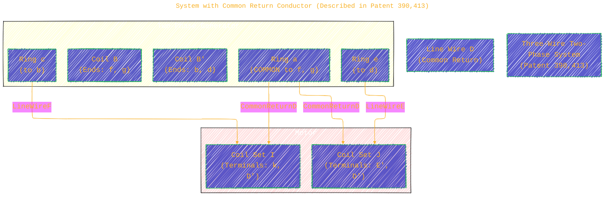
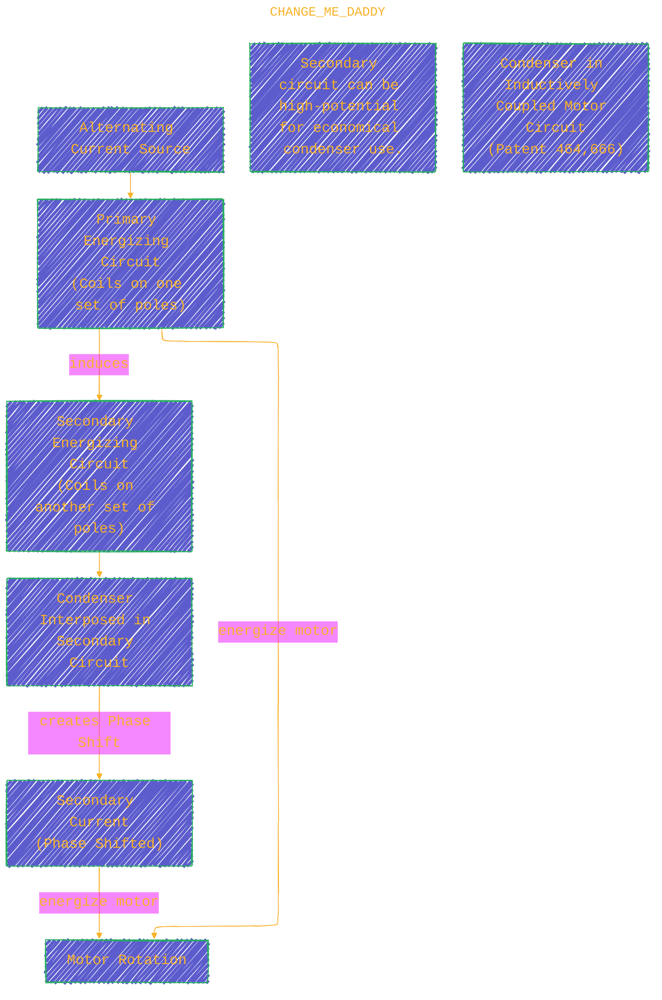

> ⚠️🏗️🚧🦺🧱🪵🪨🪚🛠️👷
> 
> This is a working draft in progress
> 
> 
>
> gif image is provided by [Giphy](https://giphy.com)
> 
> ⚠️🏗️🚧🦺🧱🪵🪨🪚🛠️👷

----

# 📜 Transmission of Power 🔋⚡🧲 POLYPHASE SYSTEM 🧲⚡🔋 Tesla patents 📃

Click to show/hide the full disclaimer.

> <ins>📢 **Disclaimer** 🚨</ins>
>
> This project is born from my fascination with blending digital art and artificial intelligence. 
> It's where I document my academic explorations, 
> share my findings with anyone interested, 
> and maintain a personal vault of my creative and technical journey. 
> I'm not sure the link for this repo being shared in the back by others, 
> since I havent plan for any analytics for this project yet. 
> ...and I'm actively looking for a job... 

> This document contains my personal notes on the topic, 
> compiled from publicly available documentation and various cited sources.
> 
> The materials are intended for educational purposes (<ins>sometimes, entertainment purposes</ins>), personal study, and technical reference.
> The content is dual-licensed:
> 1. **MIT License:** Applies to all code implementations (Swift, Mermaid, and other programming languages).
> 2. **Creative Commons Attribution-ShareAlike 4.0 International License (CC BY-SA 4.0):** Applies to all non-code content, including text, explanations, diagrams, and illustrations.

----

This document, a testament to early electrical engineering, outlines the Westinghouse Electric & Manufacturing Company's adoption and promotion of Nikola Tesla's Polyphase System for the transmission of power. Preserved and digitized by Google, this public domain work offers a fascinating glimpse into the technology that revolutionized energy distribution. 📜

The core challenge addressed was the economical transport of vast amounts of energy from natural sources, like waterfalls 🏞️, to industrial and urban centers. The document highlights the limitations of existing systems and posits Tesla's alternating current (AC) polyphase system as the transformative solution.

Let's explore the concepts presented, using diagrams to illuminate the principles.

----

## 1. The Problem: Wasted Power and the Quest for Transmission 💡

The document begins by lamenting the millions of horsepower lost from untapped waterfalls, emphasizing the economic and resource conservation benefits of harnessing this power.

```mermaid
---
title: "The Problem: Wasted Power and the Quest for Transmission 💡"
author: "Cong Le"
version: "1.0"
license(s): "MIT, CC BY-SA 4.0"
copyright: "Copyright (c) 2025 Cong Le. All Rights Reserved."
config:
  layout: elk
  theme: base
  look: handDrawn
---
%%%%%%%% Mermaid version v11.4.1-b.14
%%%%%%%% Available curve styles include the following keywords:
%% basis, bumpX, bumpY, cardinal, catmullRom, linear, monotoneX, monotoneY, natural, step, stepAfter, stepBefore.
%%{
  init: {
    'flowchart': { 'htmlLabels': true, 'curve': 'basis' },
    'fontFamily': 'American Typewriter, monospace',
    'logLevel': 'fatal',
    'themeVariables': {
      'primaryColor': '#22BB',
      'primaryTextColor': '#F8B229',
      'lineColor': '#F8B229',
      'primaryBorderColor': '#27AE60',
      'secondaryColor': '#E2F1',
      'secondaryTextColor': '#6C3483',
      'secondaryBorderColor': '#A569BD',
      'fontSize': '20px'
    }
  }
}%%
flowchart TD
    A["Untapped Natural Power<br/>(e.g., Waterfalls 🏞️)"] --> B{"Challenge:<br/>Economical Transport"}
    B --> C["Limitations of Existing Systems <br/>(e.g., DC transmission distance limits)"]
    C --> D["Search for a Solution 探索"]
    D --> E["Alternating Current Systems Emerge ✨"]

    style A fill:#22BB,stroke:#333,stroke-width:2px
    style B fill:#cb22,stroke:#333,stroke-width:2px
    style C fill:#fcb2,stroke:#333,stroke-width:2px
    style D fill:#fb22,stroke:#333,stroke-width:2px
    style E fill:#2B2B,stroke:#333,stroke-width:2px
```

*Citation: Page III, "Transmission of Power. POLYPHASE SYSTEM."*

---

## 2. Westinghouse and Tesla: A Pivotal Collaboration 🤝

Westinghouse, recognizing the potential of AC systems, initially secured the Gaulard and Gibbs patents. Their pursuit of power distribution via AC led them to Nikola Tesla's groundbreaking inventions.

*Citation: Page IV, "Transmission of Power. POLYPHASE SYSTEM."*

---

## 3. The Core Principle: Progressive Shifting of Magnetic Poles 🔄

Tesla's fundamental innovation, as highlighted in patents like No. 381,968, was the creation of a rotating magnetic field by using two or more alternating currents out of phase with each other. This "progressive shifting of the magnetism" or "lines of force" is what drives the motor.

### Conceptual Illustration

Imagine a motor with a stator (stationary part) having coils arranged around it, and a rotor (rotating part) inside. If these stator coils are energized by AC currents that are out of phase, they create magnetic poles that appear to rotate around the stator, dragging the rotor along with them.

```mermaid
---
title: "Conceptual Illustration"
author: "Cong Le"
version: "1.0"
license(s): "MIT, CC BY-SA 4.0"
copyright: "Copyright (c) 2025 Cong Le. All Rights Reserved."
config:
  layout: elk
  theme: base
  look: handDrawn
---
%%%%%%%% Mermaid version v11.4.1-b.14
%%%%%%%% Available curve styles include the following keywords:
%% basis, bumpX, bumpY, cardinal, catmullRom, linear, monotoneX, monotoneY, natural, step, stepAfter, stepBefore.
%%{
  init: {
    'flowchart': { 'htmlLabels': true, 'curve': 'basis' },
    'fontFamily': 'American Typewriter, monospace',
    'logLevel': 'fatal',
    'themeVariables': {
      'primaryColor': '#22BB',
      'primaryTextColor': '#F8B229',
      'lineColor': '#F8B229',
      'primaryBorderColor': '#27AE60',
      'secondaryColor': '#E2F1',
      'secondaryTextColor': '#6C3483',
      'secondaryBorderColor': '#A569BD',
      'fontSize': '20px'
    }
  }
}%%
flowchart TD
    subgraph MultiPhase_Generator["Multi-Phase Generator"]
    style MultiPhase_Generator fill:#2FF2,stroke:#333,stroke-width:1px, color: #FFFF
        G_Coil1["Generator Coil 1<br/>$I_1(t)$"]
        G_Coil2["Generator Coil 2<br/>$I_2(t)$"]
        PhaseDiff(["Phase Difference $\phi$"])
        G_Coil1 --> PhaseDiff
        G_Coil2 --> PhaseDiff
    end

    PhaseDiff --> Connections["Electrical Connections 🔌"]

    subgraph Polyphase_Motor["Polyphase Motor"]
    style Polyphase_Motor fill:#F2F2,stroke:#333,stroke-width:1px, color: #FFFF
        M_Coil_Set1["Motor Stator Coils - Set 1"]
        M_Coil_Set2["Motor Stator Coils - Set 2"]
        Rotor["Rotor<br/>(Armature)"]
        RotatingField(["Progressive Shifting <br/> of Magnetic Poles"])
        Connections --> M_Coil_Set1
        Connections --> M_Coil_Set2
        M_Coil_Set1 ==> RotatingField
        M_Coil_Set2 ==> RotatingField
        Rotating_Field -- induces torque --> Rotor
    end

    style Rotating_Field fill:#22BB,stroke:#333,stroke-width:2px
```

### Mathematical Representation of a Two-Phase System

For a two-phase system, the currents in the generator coils, and consequently in the motor's field coils, can be represented as:
Current in phase 1:

$$
 I_1(t) = I_{max} \cos(\omega t) 
$$

Current in phase 2 (shifted by $90^\circ$ or $\pi/2$ radians):

$$
 I_2(t) = I_{max} \cos(\omega t - \pi/2) = I_{max} \sin(\omega t) 
$$

Where:
-   $I_{max}$ is the maximum current.
-   $\omega$ is the angular frequency ($2\pi f$, where $f$ is the frequency).
-   $t$ is time.

These currents produce magnetic field components in the motor, say $B_x(t) \propto I_1(t)$ and $B_y(t) \propto I_2(t)$. The resultant magnetic field vector $\vec{B}(t)$ can be visualized as:

$$
 \vec{B}(t) = K \cdot [I_{max} \cos(\omega t) \hat{i} + I_{max} \sin(\omega t) \hat{j}] 
$$

This vector has a constant magnitude and rotates with angular velocity $\omega$, effectively "shifting the poles."

*Citation: U.S. Patent No. 381,968 (N. Tesla, May 1, 1888), page 5, lines 33-43; page 6, lines 5-101.*

### Visualizing the Pole Shift (Simplified from Patent 381,968, Figs. 1-8*)

This sequence illustrates how, as the generator armature rotates, the resultant magnetic poles in the motor shift progressively.

```mermaid
---
title: "Visualizing the Pole Shift (Simplified from Patent 381,968, Figs. 1-8*)"
author: "Cong Le"
version: "1.0"
license(s): "MIT, CC BY-SA 4.0"
copyright: "Copyright (c) 2025 Cong Le. All Rights Reserved."
config:
  layout: elk
  theme: base
  look: handDrawn
---
%%%%%%%% Mermaid version v11.4.1-b.14
%%%%%%%% Available curve styles include the following keywords:
%% basis, bumpX, bumpY, cardinal, catmullRom, linear, monotoneX, monotoneY, natural, step, stepAfter, stepBefore.
%%{
  init: {
    'flowchart': { 'htmlLabels': true, 'curve': 'basis' },
    'fontFamily': 'American Typewriter, monospace',
    'logLevel': 'fatal',
    'themeVariables': {
      'primaryColor': '#22BB',
      'primaryTextColor': '#F8B229',
      'lineColor': '#F8B229',
      'primaryBorderColor': '#27AE60',
      'secondaryColor': '#E2F1',
      'secondaryTextColor': '#6C3483',
      'secondaryBorderColor': '#A569BD',
      'fontSize': '20px'
    }
  }
}%%
flowchart LR
    subgraph Generator_Phases_and_Motor_Pole_Shift["Generator Phases and Motor Pole Shift"]
    style Generator_Phases_and_Motor_Pole_Shift fill:#F2F2,stroke:#333,stroke-width:1px, color: #FFFF
    direction LR
        P0["<b>Generator at 0°</b><br>Coil B: Max Current<br/>Coil B': Null Current"] --> M0["Motor Field:<br/>Poles at 0° (Vertical)"]
        P45["<b>Generator at 45°</b><br>Coil B: Decreasing<br>Coil B': Increasing"] --> M45["Motor Field:<br/>Poles Shifted to 45°"]
        P90["<b>Generator at 90°</b><br/>Coil B: Null Current<br>Coil B': Max Current"] --> M90["Motor Field:<br>Poles Shifted to 90°<br/>(Horizontal)"]
        P135["<b>Generator at 135°</b><br>Coil B: Increasing (Reversed)<br/>Coil B': Decreasing"] --> M135["Motor Field:<br>Poles Shifted to 135°"]
        P180["<b>Generator at 180°</b><br>Coil B: Max Current (Reversed)<br>Coil B': Null Current"] --> M180["Motor Field:<br>Poles Shifted to 180° <br/>(Vertical, Reversed)"]
        
        %%% Layout hints
        M135 --> P180
        M90 --> P135
        M45 --> P90
        M0 --> P45
        
    end
    Title["Simplified Progressive Pole Shift in a Two-Phase Motor"]
```

*(This is a conceptual representation of the states described in Patent 381,968, Figs. 1-8 and 1*-8*).*

---

## 4. Key Apparatus and System Configurations ⚙️

The document and the associated patents describe various implementations of motors, generators, and distribution systems.

### A. Basic Two-Phase Motor & Generator System

(Described in Patent 381,968, Fig. 9)

*Citation: U.S. Patent No. 381,968, page 5, lines 66-100.*

---

### B. Induction Motor Principle: Closed Armature Coils

(Described in Patent 382,279)

This type of motor uses a rotating magnetic field generated by the stator. The armature has closed conductor loops (coils E, E' in Fig. 1 of the patent) in which currents are induced by the shifting field. The interaction between these induced currents and the stator's field creates torque.

```mermaid
---
title: "Induction Motor Principle: Closed Armature Coils (Described in Patent 382,279)"
author: "Cong Le"
version: "1.0"
license(s): "MIT, CC BY-SA 4.0"
copyright: "Copyright (c) 2025 Cong Le. All Rights Reserved."
config:
  layout: elk
  theme: base
  look: handDrawn
---
%%%%%%%% Mermaid version v11.4.1-b.14
%%%%%%%% Available curve styles include the following keywords:
%% basis, bumpX, bumpY, cardinal, catmullRom, linear, monotoneX, monotoneY, natural, step, stepAfter, stepBefore.
%%{
  init: {
    'flowchart': { 'htmlLabels': true, 'curve': 'basis' },
    'fontFamily': 'American Typewriter, monospace',
    'logLevel': 'fatal',
    'themeVariables': {
      'primaryColor': '#22BB',
      'primaryTextColor': '#F8B229',
      'lineColor': '#F8B229',
      'primaryBorderColor': '#27AE60',
      'secondaryColor': '#E2F1',
      'secondaryTextColor': '#6C3483',
      'secondaryBorderColor': '#A569BD',
      'fontSize': '20px'
    }
  }
}%%
flowchart TD
    Stator[Stator Coils C, C'] -- energized by AC --> ShiftingMagField["Shifting Magnetic Field 🔄"]
    ShiftingMagField -- induces currents --> ArmatureClosedCoils["Armature with Closed Coils E, E'"]
    ArmatureClosedCoils -- creates Armature Poles --> Interaction["Magnetic Interaction<br/>(Stator & Armature Poles)"]
    Interaction -- generates --> Torque["Torque & Rotation 🚀"];
    Title2["Induction Motor Principle<br/>(Patent 382,279)"]

    style ShiftingMagField fill:#CBF2,stroke:#333
    style ArmatureClosedCoils fill:#F5C2,stroke:#333
```

*Citation: U.S. Patent No. 382,279 (N. Tesla, May 1, 1888), page 21, lines 50-103.*

---

### C. System of Electrical Distribution (Transformers/Converters)

(Described in Patent 381,970)

Tesla's system extended to transformers (termed "converters") for efficient power distribution, allowing voltage changes. The principle of shifting magnetic fields was also applied to these converters.

*Citation: U.S. Patent No. 381,970 (N. Tesla, May 1, 1888), page 16, lines 10-68; page 17, lines 1-26.*

### D. System with Common Return Conductor

(Described in Patent 390,413)

To economize on wiring, Tesla devised systems where multiple phases could share a common return wire, reducing the total number of conductors needed. For a two-phase system connected to a motor, this meant three wires instead of four.

*Citation: U.S. Patent No. 390,413 (N. Tesla, Oct. 2, 1888), page 45, lines 61-86.*

### E. Starting Synchronous Motors

(Described in Patent 401,520 and 418,248)

Synchronous motors run efficiently at a speed locked to the generator's frequency but typically cannot start on their own. Tesla developed methods to start them.
One method (Patent 401,520):
1.  **Start as a Torque Motor:** Connect motor field coils (B, C) in parallel to the AC line, with a resistance (I) in one branch and an inductance (J) in the other. This creates a phase difference, producing a rotating field and starting torque.
2.  **Switch to Synchronous Motor:** Once at or near synchronous speed, switch the connections to run the motor as a synchronous machine (e.g., both coils B and C directly in parallel or series across the line, without the R/L phase splitters).

```mermaid
---
title: "Starting Synchronous Motors (Described in Patent 401,520 and 418,248)"
author: "Cong Le"
version: "1.0"
license(s): "MIT, CC BY-SA 4.0"
copyright: "Copyright (c) 2025 Cong Le. All Rights Reserved."
config:
  layout: elk
  theme: base
  look: handDrawn
---
%%%%%%%% Mermaid version v11.4.1-b.14
%%%%%%%% Available curve styles include the following keywords:
%% basis, bumpX, bumpY, cardinal, catmullRom, linear, monotoneX, monotoneY, natural, step, stepAfter, stepBefore.
%%{
  init: {
    'flowchart': { 'htmlLabels': true, 'curve': 'basis' },
    'fontFamily': 'American Typewriter, monospace',
    'logLevel': 'fatal',
    'themeVariables': {
      'primaryColor': '#22BB',
      'primaryTextColor': '#F8B229',
      'lineColor': '#F8B229',
      'primaryBorderColor': '#27AE60',
      'secondaryColor': '#E2F1',
      'secondaryTextColor': '#6C3483',
      'secondaryBorderColor': '#A569BD',
      'fontSize': '20px'
    }
  }
}%%
flowchart TD
    Start["Start AC Supply"] --> SwitchPos1["Switch Position 1:<br/>Torque Mode"]
    subgraph TorqueMode ["Torque Mode<br/>(Starting)"]
    style TorqueMode fill:#F222,stroke:#333,stroke-width:1px, color: #FFFF
        Circuit_B[Motor Circuit B] --> With_Inductor_J["+ Inductive Coil J"]
        Circuit_C[Motor Circuit C] --> With_Resistor_I["+ Resistance I"]
        AC_Line[AC Line L, L'] --> Circuit_B
        AC_Line --> Circuit_C
        With_Inductor_J & With_Resistor_I --> PhaseDifference["Phase Difference Created"]
        PhaseDifference --> RotatingFieldStart["Rotating Field Starts Motor 🌀"]
    end

    RotatingFieldStart --> AttainSpeed{"Motor Reaches Near<br>Synchronous Speed?"}
    AttainSpeed -- Yes --> SwitchPos2["Switch Position 2:<br/>Synchronous Mode"]
    AttainSpeed -- No --> RotatingFieldStart

    subgraph SynchronousMode ["Synchronous Mode<br/>(Running)"]
    style SynchronousMode fill:#F2B2,stroke:#333,stroke-width:1px, color: #FFFF
      Circuit_B_Sync["Motor Circuit B"]
      Circuit_C_Sync["Motor Circuit C"]
      AC_Line_Sync["AC Line L, L'"] --> Circuit_B_Sync
      AC_Line_Sync --> Circuit_C_Sync
      Circuit_B_Sync & Circuit_C_Sync --> SynchronousOperation["Motor Runs Synchronously 🏃‍♂️"]
    end

    SwitchPos2 --> SynchronousOperation;
    Title5["Synchronous Motor Starting Method<br/>(Patent 401,520)"]

    %% style TorqueMode fill:#E6E6FA, stroke:#333
    %% style SynchronousMode fill:#D4F8E0, stroke:#333
```

*Citation: U.S. Patent No. 401,520 (N. Tesla, Apr. 16, 1889), page 61, lines 61-82; page 62, lines 37-59.*

Another method (Patent 418,248) involved starting by progressively shifting poles using AC, short-circuiting the other element's coils (e.g., field coils short-circuited if armature carries AC). Once at speed, the previously short-circuited coils are connected to a DC source, and the AC connections are changed for simple pole alternation, enabling synchronous operation.

### F. Motor Speed Regulation

(Described in Patent 390,820)

This patent describes a regulator, essentially a variable transformer, where one element (e.g., secondary coil F on core E) is movable relative to the other (primary coils C on cores B B). By changing their relative angular position, the induced current in the secondary (which might feed one set of motor field coils) can be varied, thus regulating motor speed or torque.

```mermaid
---
title: "Motor Speed Regulation (Described in Patent 390,820)"
author: "Cong Le"
version: "1.0"
license(s): "MIT, CC BY-SA 4.0"
copyright: "Copyright (c) 2025 Cong Le. All Rights Reserved."
config:
  layout: elk
  theme: base
  look: handDrawn
---
%%%%%%%% Mermaid version v11.4.1-b.14
%%%%%%%% Available curve styles include the following keywords:
%% basis, bumpX, bumpY, cardinal, catmullRom, linear, monotoneX, monotoneY, natural, step, stepAfter, stepBefore.
%%{
  init: {
    'flowchart': { 'htmlLabels': true, 'curve': 'basis' },
    'fontFamily': 'American Typewriter, monospace',
    'logLevel': 'fatal',
    'themeVariables': {
      'primaryColor': '#22BB',
      'primaryTextColor': '#F8B229',
      'lineColor': '#F8B229',
      'primaryBorderColor': '#27AE60',
      'secondaryColor': '#E2F1',
      'secondaryTextColor': '#6C3483',
      'secondaryBorderColor': '#A569BD',
      'fontSize': '20px'
    }
  }
}%%
flowchart LR
    subgraph Regulator_Device["Regulator Device"]
    style Regulator_Device fill:#F2B2,stroke:#333,stroke-width:1px, color: #FFFF
        PrimaryCoils_C["Primary Coils C<br/>(Fixed)"] -- OnCores_B --> MagField1["Magnetic Field from Primary"]
        SecondaryCoil_F["Secondary Coil F<br/>(Movable)"] -- OnCore_E --> InducedCurrent["Induced Current in Secondary"]
        Handle_Q["Handle Q"] -- Adjusts --> SecondaryCoil_F_Position["Angular Position of Coil F"]
        SecondaryCoil_F_Position -- AffectsCoupling --> MagField1
        MagField1 -- InducesIn --> SecondaryCoil_F
    end

    subgraph Motor_Circuit["Motor Circuit"]
    style Motor_Circuit fill:#FB22,stroke:#333,stroke-width:1px, color: #FFFF
        AC_Generator_H["AC Generator H"] --> MainCircuit["Main Motor Circuit<br/>(e.g., Armature K)"]
        MainCircuit --> PrimaryCoils_C
        InducedCurrent --> MotorField_L["Motor Field Coils L<br/>(Variable Excitation)"]
        MotorField_L & MainCircuit -- InteractIn --> Motor_J["Motor J"]
        Motor_J --> SpeedTorque["Variable Speed/Torque Output"]
    end
    Title6["Motor Speed Regulation Concept<br/>(Patent 390,820)"]
```

*Citation: U.S. Patent No. 390,820 (N. Tesla, Oct. 9, 1888), page 57, lines 26-53; page 58, lines 20-47.*

### G. Use of Condensers in Motor Circuits

(Described in Patent 455,067 and 464,666)

Tesla recognized the effects of self-induction in motor coils. To counteract this and to create or enhance phase differences, he proposed using condensers.
-   **Patent 455,067:** Connects a condenser (F) across the terminals of closed armature coils (E) in a motor. This counteracts self-induction in the armature, potentially increasing current and improving phase relationships for better torque.

*Citation: U.S. Patent No. 455,067 (N. Tesla, June 30, 1891), page 114, lines 34-50.*

-   **Patent 464,666:** Describes a motor where primary coils energize one set of poles, and secondary coils (closed through a condenser) energize another set of poles. The condenser helps create the necessary phase shift in the secondary circuit's current. This is particularly useful for creating high potential in the secondary to make condenser use economical.

*Citation: U.S. Patent No. 464,666 (N. Tesla, Dec. 8, 1891), page 122, lines 49-68; page 123, lines 1-11.*

---

## 5. Advantages of the Tesla Polyphase System 🌟

The document concludes by summarizing the key benefits of this system:

*Citation: Page VIII, lines 75-91, "Transmission of Power. POLYPHASE SYSTEM."*

---

## 6. Conclusion 🏁

The introduction of Tesla's Polyphase System by Westinghouse marked a pivotal moment in electrical engineering. It laid the foundation for modern AC power grids, enabling the efficient transmission and utilization of electrical energy over long distances, which profoundly impacted industrial development and daily life. The principles detailed in these early patents continue to be fundamental to electrical machines today.

---

<!-- 

---
><b>Licenses</b>:
>
>- <b>MIT License</b>:   - Full text in [LICENSE](LICENSE) file.
>- <b>Creative Commons Attribution-ShareAlike 4.0 International</b>: [CC BY-SA 4.0](https://creativecommons.org/licenses/by-sa/4.0/)  - Legal details in [LICENSE-CC-BY-SA-4.0](THE_PAST/LICENSE-CC-BY-SA-4.0) and at [Creative Commons official site](https://creativecommons.org/licenses/by-sa/4.0/).
>
---

### References 📚

*   Main Document: *Transmission of Power. POLYPHASE SYSTEM.* Westinghouse Electric and Manufacturing Company, Pittsburgh, Penn. January 16th, 1893. (Digitized by Google)
*   U.S. Patent No. 381,968: "Electro Magnetic Motor" by N. Tesla, May 1, 1888.
*   U.S. Patent No. 381,969: "Electro Magnetic Motor" by N. Tesla, May 1, 1888.
*   U.S. Patent No. 381,970: "System of Electrical Distribution" by N. Tesla, May 1, 1888.
*   U.S. Patent No. 382,279: "Electro Magnetic Motor" by N. Tesla, May 1, 1888.
*   U.S. Patent No. 382,280: "Electrical Transmission of Power" by N. Tesla, May 1, 1888.
*   U.S. Patent No. 382,281: "Electrical Transmission of Power" by N. Tesla, May 1, 1888.
*   U.S. Patent No. 382,282: "Method of Converting and Distributing Electric Currents" by N. Tesla, May 1, 1888.
*   U.S. Patent No. 390,413: "System of Electrical Distribution" by N. Tesla, Oct. 2, 1888.
*   U.S. Patent No. 390,414: "Dynamo-Electric Machine" by N. Tesla, Oct. 2, 1888.
*   U.S. Patent No. 390,721: "Dynamo-Electric Machine" by N. Tesla, Oct. 9, 1888.
*   U.S. Patent No. 390,820: "Regulator for Alternate Current Motors" by N. Tesla, Oct. 9, 1888.
*   U.S. Patent No. 401,520: "Method of Operating Electro-Magnetic Motors" by N. Tesla, Apr. 16, 1889.
*   U.S. Patent No. 405,858: "Electro-Magnetic Motor" by N. Tesla, June 25, 1889.
*   U.S. Patent No. 416,191: "Electro Magnetic Motor" by N. Tesla, Dec. 3, 1889.
*   U.S. Patent No. 416,192: "Method of Operating Electro Magnetic Motors" by N. Tesla, Dec. 3, 1889.
*   U.S. Patent No. 416,193: "Electro Magnetic Motor" by N. Tesla, Dec. 3, 1889.
*   U.S. Patent No. 416,194: "Electric Motor" by N. Tesla, Dec. 3, 1889.
*   U.S. Patent No. 416,195: "Electro-Magnetic Motor" by N. Tesla, Dec. 3, 1889.
*   U.S. Patent No. 418,248: "Electro-Magnetic Motor" by N. Tesla, Dec. 31, 1889.
*   U.S. Patent No. 424,036: "Electro Magnetic Motor" by N. Tesla, Mar. 25, 1890.
*   U.S. Patent No. 433,700: "Alternating-Current Electro-Magnetic Motor" by N. Tesla, Aug. 5, 1890.
*   U.S. Patent No. 433,701: "Alternating-Current Motor" by N. Tesla, Aug. 5, 1890.
*   U.S. Patent No. 433,702: "Electrical Transformer or Induction Device" by N. Tesla, Aug. 5, 1890.
*   U.S. Patent No. 433,703: "Electro-Magnetic Motor" by N. Tesla, Aug. 5, 1890.
*   U.S. Patent No. 445,207: "Electro Magnetic Motor" by N. Tesla, Jan. 27, 1891.
*   U.S. Patent No. 455,067: "Electro-Magnetic Motor" by N. Tesla, June 30, 1891.
*   U.S. Patent No. 459,772: "Electro-Magnetic Motor" by N. Tesla, Sept. 22, 1891.
*   U.S. Patent No. 464,666: "Electro Magnetic Motor" by N. Tesla, Dec. 8, 1891.

-----
