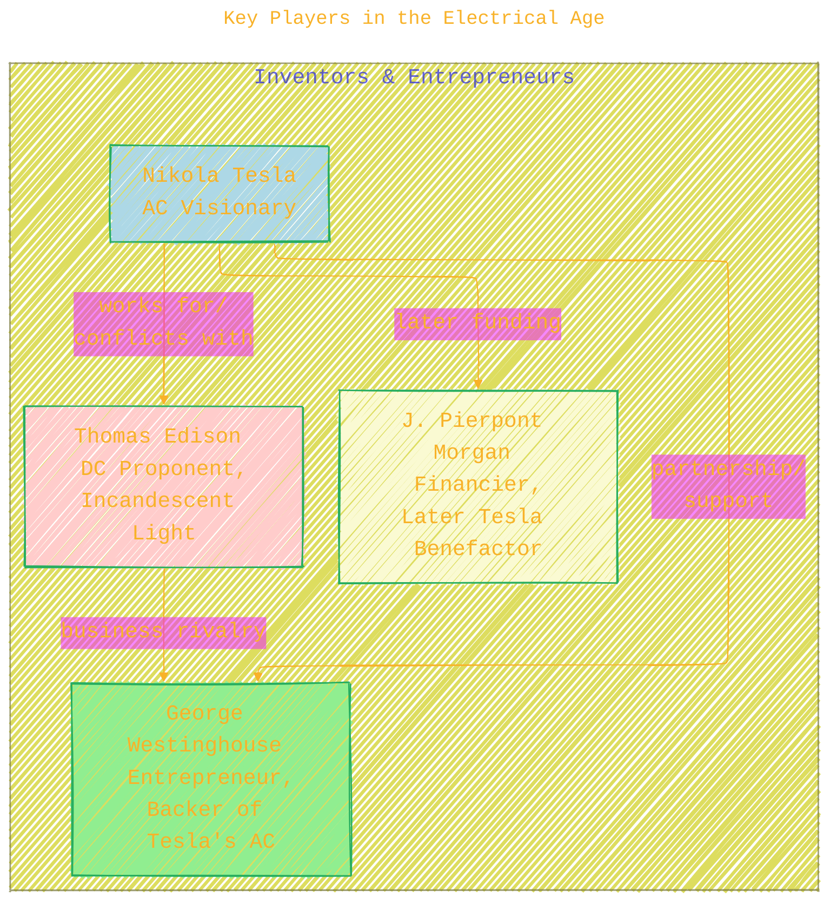

> ⚠️🏗️🚧🦺🧱🪵🪨🪚🛠️👷
> 
> This is a working draft in progress
> 
> 
>
> gif image is provided by [Giphy](https://giphy.com)
> 
> ⚠️🏗️🚧🦺🧱🪵🪨🪚🛠️👷


----


# Nikola Tesla: A Journey of Brilliance and Imagination ✨
<details open>
<summary>Click to show/hide the full disclaimer.</summary>
   
> <ins>📢 **Disclaimer** 🚨</ins>
>
> This document contains my personal notes on the topic,
> compiled from publicly available documentation and various cited sources.
> The materials are intended for educational purposes (<ins>sometimes, entertainment purposes</ins>), personal study, and reference.
> The content is dual-licensed:
> 1. **MIT License:** Applies to all code implementations (Swift, Mermaid, and other programming languages).
> 2. **Creative Commons Attribution-ShareAlike 4.0 International License (CC BY-SA 4.0):** Applies to all non-code content, including text, explanations, diagrams, and illustrations.

</details>

---


---

## Early Life & Seeds of Genius 🌱

Nikola Tesla, born in 1856 in Smiljan, Croatia, was a child of keen imagination and intellect. His early life was marked by a passion for science, particularly electricity, which he pursued despite initial parental resistance.

Let's visualize Tesla's early path and pivotal moments:

```mermaid
---
title: "Early Life & Seeds of Genius 🌱"
author: "Cong Le"
version: "1.0"
license(s): "MIT, CC BY-SA 4.0"
copyright: "Copyright (c) 2025 Cong Le. All Rights Reserved."
config:
  layout: elk
  theme: base
  look: handDrawn
---
%%%%%%%% Mermaid version v11.4.1-b.14
%%%%%%%% Available curve styles include the following keywords:
%% basis, bumpX, bumpY, cardinal, catmullRom, linear, monotoneX, monotoneY, natural, step, stepAfter, stepBefore.
%%{
  init: {
    'flowchart': { 'htmlLabels': true, 'curve': 'basis' },
    'fontFamily': 'American Typewriter, monospace',
    'logLevel': 'fatal',
    'themeVariables': {
      'primaryColor': '#22BB',
      'primaryTextColor': '#F8B229',
      'lineColor': '#F8B229',
      'primaryBorderColor': '#27AE60',
      'secondaryColor': '#E2F1',
      'secondaryTextColor': '#6C3483',
      'secondaryBorderColor': '#A569BD',
      'fontSize': '20px'
    }
  }
}%%
flowchart TD
    A["Born in Smiljan, Croatia<br/>(1856) 🇭🇷"] --> B("Prodigious child:<br/>fluent in 6 languages, fascinated by mechanics")
    B --> C{"Family expected Priesthood/Military"}
    C -- Childhood Illness --> D["Permission to study Science 👍"]
    D --> E["Attended school in Gospic"]
    E --> F["College in Carlstadt:<br/>Discovers passion for Electricity ⚡"]
    F --> G["Cholera Epidemic:<br/>Delays studies but solidifies engineering path"]
    G --> H["Studies Electrical Engineering at Polytechnic Institute, Graz, Austria<br/>(1875)"]
    H --> I("Observes Gramme Dynamo")
    I --> J{"Intrigued by AC vs. DC:<br/>Why convert AC to DC? 🤔"}
    J --> K["Fails to solve AC motor problem initially"]
    K --> L["Studies at University of Prague"]
    L --> M["Works at Hungarian Telegraph Office, Budapest<br/>(1881)"]
    M --> N("Manages telephone company, invents, but AC fixation leads to breakdown 🤕")
    N --> O["Recovers, still captivated by AC motor puzzle"]
    O --> P(("Dramatic Revelation:<br/>AC Motor Solution!<br/>(Feb 1882) 💡"))
    P --> Q["Moves to Paris:<br/>Works for Continental Edison<br/>(April 1882) 🇫🇷"]

    style A fill:#f9f,stroke:#333,stroke-width:2px
    style P fill:#lightgreen,stroke:#333,stroke-width:2px
    style J fill:#lightblue,stroke:#333,stroke-width:2px
    style N fill:#ffcc99,stroke:#333,stroke-width:2px
```



----

## From Dreams to Reality: The AC Motor 💡

Tesla's vision for an AC motor was revolutionary. The prevailing electrical standard was Direct Current (DC). His "mental gymnastics" and detailed visualizations were key to his inventive process.

**Tesla's Inventive Process:**

```mermaid
---
title: "From Dreams to Reality: The AC Motor 💡"
author: "Cong Le"
version: "1.0"
license(s): "MIT, CC BY-SA 4.0"
copyright: "Copyright (c) 2025 Cong Le. All Rights Reserved."
config:
  layout: elk
  theme: base
  look: handDrawn
---
%%%%%%%% Mermaid version v11.4.1-b.14
%%%%%%%% Available curve styles include the following keywords:
%% basis, bumpX, bumpY, cardinal, catmullRom, linear, monotoneX, monotoneY, natural, step, stepAfter, stepBefore.
%%{
  init: {
    'flowchart': { 'htmlLabels': true, 'curve': 'basis' },
    'fontFamily': 'American Typewriter, monospace',
    'logLevel': 'fatal',
    'themeVariables': {
      'primaryColor': '#22BB',
      'primaryTextColor': '#F8B229',
      'lineColor': '#F8B229',
      'primaryBorderColor': '#27AE60',
      'secondaryColor': '#E2F1',
      'secondaryTextColor': '#6C3483',
      'secondaryBorderColor': '#A569BD',
      'fontSize': '20px'
    }
  }
}%%
flowchart LR
    subgraph Tesla_Mind["Tesla's Mind"]
        A["Initial Problem/Question <br/> (e.g., AC Motor)"] -- pondering --> B{"Detailed Visualization <br/> (Mental Model Construction)"}
        B -- mental examination --> C{"Refinement<br/> (Imagine it running, check for wear)"}
        C -- if flawed --> B
        C -- if sound --> D["Preserved Mental Image 🧠"]
    end
    D -- opportunity/<br/>resources --> E["Physical Construction<br/>(Building the Model)"]
    E --> F["Testing & Validation <br/> (Model Works!) ✅"]

    style A fill:#cceeff
    style B fill:#ccffcc
    style D fill:#ffffcc
    style F fill:#e6fffa
```



While in Paris, working for Continental Edison, Tesla's brilliance shone, but his AC ideas found little support. A disastrous DC installation in Strasburg, Germany, ironically gave him the time to build a working model of his AC dynamo.

----

## Coming to America & The "War of Currents" 🗽⚔️

Tesla arrived in New York in 1884, initially working for Thomas Edison. However, disagreements led to his departure. After a period of hardship (even working as a ditch digger! ⛏️), he found new backers.

**Tesla Electric Company & AC Patents:**
In April 1887, the **Tesla Electric Company** was formed. Tesla's work on his AC system culminated in several key patents issued on May 1, 1888. This marked the true beginning of the AC revolution.

**Key Players in the Electrical Age:**



The introduction of AC power sparked the "War of Currents" primarily between Edison's DC systems and Tesla/Westinghouse's AC systems.


Tesla's demonstration at the **1893 Columbian Exhibition in Chicago**, where Westinghouse used Tesla's AC technology to illuminate the fair, was a major victory for AC. Tesla dramatically passed one million volts through his body to disprove claims that AC was inherently too dangerous. 😮

The harnessing of Niagara Falls in 1895 to generate and transmit AC power over 22 miles to Buffalo further solidified AC's dominance.
*   Power Output: $P = 37,300 \text{ kilowatts}$

----

## Electrical Endeavors: High Frequencies & The Tesla Coil 🌀

Tesla's genius wasn't limited to AC power generation. He delved into high-frequency phenomena.

*   Early experiments: Reached frequencies up to $f = 20,000 \text{ cycles per second}$ (20 kHz) at very high voltages.
*   Public demonstration (1891): 100,000 Volt spark discharges, five inches long! ⚡
	*   $V_{\text{spark}} = 100,000 \text{ V}$

These experiments led to the invention of the **Tesla Coil**.

### The Science Behind Tesla's Inventions

**1. Faraday's Law of Induction (Conceptual Basis):**
The document mentions Michael Faraday's demonstration of electromagnetism:
*   Moving magnet near a coil $\implies$ Induced electric current.
*   This principle underlies dynamos (generators).

**2. Two-Phase Induction Motor:**
Tesla's solution to an AC motor involved creating a rotating magnetic field.


This design resulted in a smooth-running, commutator-free motor.

**3. The Tesla Transformer (Tesla Coil):**
A device for producing high-voltage, high-frequency alternating currents.

```mermaid
---
title: "The Tesla Transformer (Tesla Coil)"
author: "Cong Le"
version: "1.0"
license(s): "MIT, CC BY-SA 4.0"
copyright: "Copyright (c) 2025 Cong Le. All Rights Reserved."
config:
  layout: elk
  theme: base
  look: handDrawn
---
%%%%%%%% Mermaid version v11.4.1-b.14
%%%%%%%% Available curve styles include the following keywords:
%% basis, bumpX, bumpY, cardinal, catmullRom, linear, monotoneX, monotoneY, natural, step, stepAfter, stepBefore.
%%{
  init: {
    'flowchart': { 'htmlLabels': true, 'curve': 'basis' },
    'fontFamily': 'American Typewriter, monospace',
    'logLevel': 'fatal',
    'themeVariables': {
      'primaryColor': '#22BB',
      'primaryTextColor': '#F8B229',
      'lineColor': '#F8B229',
      'primaryBorderColor': '#27AE60',
      'secondaryColor': '#E2F1',
      'secondaryTextColor': '#6C3483',
      'secondaryBorderColor': '#A569BD',
      'fontSize': '20px'
    }
  }
}%%
flowchart TD
    subgraph Tesla_Coil["TeslaCoil <br/>Tesla Coil Operation"]
        A["Power Source (AC/DC)"] --> B("Capacitor C")
        B -- Charges --> SG{"Spark Gap"}
        SG -- Breakdown Voltage Reached --> Spark1["Sparks! ✨"]
        Spark1 --> OSC1["Primary Oscillatory Circuit Formed (L1-C-SG)"]
        OSC1 -- High-Frequency Pulsations --> PCOIL["Primary Coil L1 (Few Turns)"]
        PCOIL -- "Electromagnetic Induction <br> (Mutual Inductance M)" --> SCOIL["Secondary Coil L2 (Many Turns)"]
        SCOIL -- "Resonance (when $f_1 \approx f_2$)" --> HVOUT["High Voltage, High Frequency Output <br> (Millions of Volts!)"]
        HVOUT --> Terminal["Terminal Emits Spectacular Sparks ⚡⚡"]
    end

    style Tesla_Coil fill:#e0f7fa,stroke:#00796b,stroke-width:2px;
    style A fill:#ffcdd2, stroke:#c62828;
    style B fill:#fff9c4, stroke:#f57f17;
    style SG fill:#c8e6c9, stroke:#2e7d32;
    style Spark1 fill:#bbdefb, stroke:#0d47a1;
    style OSC1 fill:#d1c4e9, stroke:#311b92;
    style PCOIL fill:#f8bbd0, stroke:#880e4f;
    style SCOIL fill:#ffe0b2, stroke:#e65100;
    style HVOUT fill:#b2dfdb, stroke:#004d40;
    style Terminal fill:#ffecb3,stroke:#ff8f00

```



**Key Mathematical Concepts for Tesla Coil:**
*   **Capacitor Charging:** Current charges the capacitor ($C$).
*   **Spark Gap Breakdown Voltage:** $V_B$.
*   **Oscillating Circuit (LC Circuit):** When the spark gap fires, the primary coil ($L_1$) and capacitor ($C$) form an LC circuit. Its natural resonant frequency is approximately:
	$f_1 \approx \frac{1}{2\pi\sqrt{L_1 C}}$
*   **Transformer Principle:** The voltage step-up from primary to secondary is related to the turns ratio (though more complex in resonant air-core transformers like Tesla coils):
	$\frac{V_s}{V_p} \approx \frac{N_s}{N_p}$ (for ideal iron-core transformers, indicative for Tesla coils)
	Where $N_s$ is turns in secondary, $N_p$ is turns in primary. Since $N_s \gg N_p$ in a Tesla coil, $V_s \gg V_p$.
*   **Resonance:** Optimum operation when the resonant frequency of the primary circuit matches that of the secondary circuit ($f_2$). This allows for maximum energy transfer and voltage multiplication in the secondary.
	$f_1 \approx f_2$ for resonance.

----

## Later Years & Ambitious Projects 🌍📡

Tesla's experiments grew grander and more ambitious:
*   **Colorado Springs (1899):**
	*   Huge Tesla coils (75 feet in diameter!).
	*   Artificial lightning bolts $135 \text{ feet}$ long.
	*   Believed he charged the Earth itself and detected extraterrestrial signals (though this is debated).
	*   Experiments allegedly overloaded the local power station. 😱
*   **Wardenclyffe Tower (Long Island, 1900-1905):**
	*   Funded by J. Pierpont Morgan.
	*   Intended for worldwide wireless broadcasting of power and information.
	*   A 154-foot tower was the centerpiece.
	*   Project eventually ceased due to funding issues and Tesla's grandiose (and perhaps not fully commercializable) vision.

```dot
/*
 * title: Wardenclyffe Tower
 * author: Cong Le
 * version: 1.0
 * license(s): MIT, CC BY-SA 4.0
 * copyright: Copyright (c) 2025 Cong Le. All Rights Reserved.
 */
digraph Wardenclyffe_Concept {
    rankdir="LR";
    node [shape=box, style=rounded];
    bgcolor="transparent";

    subgraph cluster_Vision {
        label="Tesla's Vision for Wardenclyffe";
        style="filled";
        color="lightgrey";
        node [style=filled,color=lightblue];

        Tower [label="Wardenclyffe Tower\n(154 ft)", shape=cylinder, color=skyblue, style=filled];
        GlobalPower [label="Wireless Global Power Transmission 🌎⚡"];
        GlobalComms [label="Worldwide Wireless Communication 📡"];
        AdvancingHumanity [label="Advancing Humanity (Tesla's Goal)"];
    }

    subgraph cluster_Support {
        label="Support & Construction";
        style="filled";
        color="lightyellow";
        node [style=filled,color=lightgoldenrodyellow];

        JPMorgan [label="J.P. Morgan\n(Financial Backer 💰)"];
        StanfordWhite [label="Stanford White\n(Architect)"];
        Construction [label="Construction in Long Island (1900)"];
    }

    subgraph cluster_Outcome {
        label="Challenges & Outcome";
        style="filled";
        color="lightpink";
        node [style=filled,color=mistyrose];

        Delays [label="Project Delays ⏳"];
        UnpaidBills [label="Financial Difficulties 💸"];
        ProjectCeased [label="Project Ceased (1905) 🛑"];
    }

    JPMorgan -> Construction;
    StanfordWhite -> Construction;
    Construction -> Tower;
    Tower -> GlobalPower [label="intended for"];
    Tower -> GlobalComms [label="intended for"];
    GlobalPower -> AdvancingHumanity;
    GlobalComms -> AdvancingHumanity;

    Construction -> Delays [style=dotted];
    Delays -> UnpaidBills [style=dotted];
    UnpaidBills -> ProjectCeased [style=dotted];
    JPMorgan -> ProjectCeased [label="withdrew support", style=dotted, color=red];
}
```



----

## Philosophy and Legacy 🌌

*   **Pure vs. Applied Science:** Tesla considered himself an "inspirational discoverer" (pure scientist) and Edison a "methodical improver" (applied scientist). This contributed to his refusal of a shared Nobel Prize with Edison in 1912 (though the prize ultimately went to Gustav Dalen).
*   **Humanity's Progress:** He believed energy availability was key to human progress and saw his work as "advancing humanity."
*   **Later Life:** Continued to work and make announcements but often without experimental details. Spoke of "death rays" and sending beams to the moon.
*   **Death:** Died on January 7, 1943. His papers were seized by the FBI.

Tesla's contributions were monumental, shaping much of the electrical technology we use today. From AC power systems that light our cities 🏙️ and power our industries, to principles underlying radio and wireless technology, his inventive spirit echoes through modern science.

---

## Key Inventions Summary 📜


---

## Conclusion

Nikola Tesla was a visionary scientist and inventor whose work revolutionized the field of electrical engineering. His development of the alternating current (AC) system formed the backbone of modern electrical power distribution. His "brilliant imaginings" led to inventions like the Tesla coil, laid groundwork for wireless communication, and demonstrated a profound understanding of electromagnetic phenomena. Despite facing financial hardships and sometimes lacking business acumen, his dedication to advancing scientific knowledge for humanity left an indelible mark on the world. 🚀

----

### References and Citations

*   The primary source for this information is the article on Nikola Tesla from **The Franklin Institute**. ([fi.edu](https://fi.edu/)). Specific links to assets and reports are also provided in the original document, such as the [Cresson Award information](https://www.fi.edu/en/awards/laureates/nikola-tesla) and the [PDF report on Tesla's Researches in High Frequency Phenomena](https://fi.edu/sites/default/files/2016-04/NikolaTesla_CaseFileReports_TheFranklinInstitute.pdf).

The images linked at the end of the document (letters, motor, letterhead) provide valuable historical context and are artifacts held by The Franklin Institute.

----

It's truly inspiring to reflect on Tesla's life – a journey from a small village to becoming a figure whose inventions continue to power our world. ✨

----

```mermaid
---
title: "❓...CongLeSolutionX....❓"
author: "Cong Le"
version: "1.0"
license(s): "MIT, CC BY-SA 4.0"
copyright: "Copyright (c) 2025 Cong Le. All Rights Reserved."
config:
  theme: base
---
%%%%%%%% Mermaid version v11.4.1-b.14
%%{
  init: {
    'flowchart': { 'htmlLabels': false },
    'fontFamily': 'Bradley Hand',
    'themeVariables': {
      'primaryColor': '#fc82',
      'primaryTextColor': '#F8B229',
      'primaryBorderColor': '#27AE60',
      'secondaryColor': '#5229',
      'secondaryTextColor': '#6C3483',
      'lineColor': '#F8B229',
      'fontSize': '20px'
    }
  }
}%%
flowchart LR
    My_Meme@{ img: "https://raw.githubusercontent.com/CongLeSolutionX/CongLeSolutionX/refs/heads/main/assets/images/My-meme-and-question-marks-open-book-old-characters-background.png", label: "..🙉..👀..📖..", pos: "b", w: 200, h: 150, constraint: "off" }
   
    Link_to_my_profile{{"<a href='https://github.com/CongLeSolutionX' target='_blank'>Click here if you care about my profile</a>"}}

  Closing_quote@{ shape: braces, label: "..👀..<br/>'Unfortunately,<br/>no one can be told<br/> what the Matrix is.<br/>You have to see it<br/>for yourself'<br/>...📚..<br/>-<ins>Morpheus,<br/>a character from the movie The Matrix 1999</ins>"}

   Closing_quote ~~~ My_Meme

    My_Meme animatingEdge@--> Link_to_my_profile
  
  animatingEdge@{ animate: true }

```

---
><b>Licenses</b>:
>
>- <b>MIT License</b>:  [](LICENSE) - Full text in [LICENSE](LICENSE) file.
>- <b>Creative Commons Attribution-ShareAlike 4.0 International</b>: [CC BY-SA 4.0](https://creativecommons.org/licenses/by-sa/4.0/) [](https://creativecommons.org/licenses/by-sa/4.0/) - Legal details in [LICENSE-CC-BY-SA-4.0](THE_PAST/LICENSE-CC-BY-SA-4.0) and at [Creative Commons official site](https://creativecommons.org/licenses/by-sa/4.0/).
>
---