> ⚠️🏗️🚧🦺🧱🪵🪨🪚🛠️👷
> 
> This is a working draft in progress
> 
> 
>
> gif image is provided by [Giphy](https://giphy.com)
> 
> ⚠️🏗️🚧🦺🧱🪵🪨🪚🛠️👷


----


# 🏛️ The Franklin Institute's Report on Nikola Tesla's Researches (1893)

> **Disclaimer:**
>
> This document contains my personal notes on the topic,
> compiled from publicly available documentation and various cited sources.
> The materials are intended for educational purposes, personal study, and reference.
> The content is dual-licensed:
> 1. **MIT License:** Applies to all code implementations (Swift, Mermaid, and other programming languages).
> 2. **Creative Commons Attribution-ShareAlike 4.0 International License (CC BY-SA 4.0):** Applies to all non-code content, including text, explanations, diagrams, and illustrations.
---

This document is a significant historical record from the **Franklin Institute of the State of Pennsylvania**, reflecting the scientific community's assessment of Nikola Tesla's groundbreaking work in the late 19th century.

----

## 📄 Document Overview and Outcome

The core of the document is a report submitted by a sub-committee to the **Committee on Science and the Arts** of the Franklin Institute. This report evaluates Nikola Tesla's research, leading to a significant recognition.

```mermaid
---
title: "📄 Document Overview and Outcome"
author: "Cong Le"
version: "1.0"
license(s): "MIT, CC BY-SA 4.0"
copyright: "Copyright (c) 2025 Cong Le. All Rights Reserved."
config:
  layout: elk
  theme: base
  look: handDrawn
---
%%%%%%%% Mermaid version v11.4.1-b.14
%%%%%%%% Available curve styles include the following keywords:
%% basis, bumpX, bumpY, cardinal, catmullRom, linear, monotoneX, monotoneY, natural, step, stepAfter, stepBefore.
%%{
  init: {
    'flowchart': { 'htmlLabels': true, 'curve': 'basis' },
    'fontFamily': 'American Typewriter, monospace',
    'logLevel': 'fatal',
    'themeVariables': {
      'primaryColor': '#22BB',
      'primaryTextColor': '#F8B229',
      'lineColor': '#F8B229',
      'primaryBorderColor': '#27AE60',
      'secondaryColor': '#E2F1',
      'secondaryTextColor': '#6C3483',
      'secondaryBorderColor': '#A569BD',
      'fontSize': '20px'
    }
  }
}%%
flowchart TD
    A["Sub-Committee Investigates Tesla's Researches"] --> B("Deliberation on <b>Nikola Tesla's Researches in High Frequency Phenomena</b>")
    B --> C["Report Submitted to the Committee on Science and the Arts"]
    C --> D{"Recommendation for Recognition"}
    D -- Endorsement --> E["Franklin Institute Awards Nikola Tesla"]
    E --> F["🏆 Elliott Cresson Gold Medal <br> Adopted: Dec. 6, 1893"]

    subgraph Signatories_SubCommittee["Report Signatories<br/>(Sub-Committee)"]
    style Signatories_SubCommittee fill:#F3F4,stroke:#333,stroke-width:1px, color: #FFF
        S1["Carl Hering<br/>(Chairman)"]
        S2["J. Carpenter Smith"]
        S3["Edwin J. Houston <br/><i>(or similar, signature stylized)</i>"]
        S4["Hermann J. Hering"]
    end

    subgraph Signatory_MainCommittee["Adoption Signatory<br/>(Main Committee)"]
    style Signatory_MainCommittee fill:#F3F4,stroke:#333,stroke-width:1px, color: #FFF
        S5["Signature unclear <br/><i>(Chairman of Committee on Science and the Arts)</i>"]
    end

    C -.-> Signatories_SubCommittee
    F -.-> Signatory_MainCommittee

    style A fill:#DA22,stroke:#333,stroke-width:2px
    style B fill:#EDF1,stroke:#333,stroke-width:2px
    style C fill:#D2EB,stroke:#333,stroke-width:2px
    style D fill:#FCF2,stroke:#333,stroke-width:2px
    style E fill:#FAF1,stroke:#333,stroke-width:2px
    style F fill:#FD22,stroke:#gold,stroke-width:4px
```



**Key Takeaway:** The Franklin Institute, a prominent scientific body, formally recognized the exceptional value of Tesla's contributions to the science of electricity.

----

## 🗓️ Timeline of Tesla's Influential Lectures & Publications (as cited in the report)

The report emphasizes three key illustrated lectures delivered by Nikola Tesla, which widely disseminated his findings:

```mermaid
---
title: "Timeline of Tesla's Influential Lectures & Publications"
author: "Cong Le"
version: "1.0"
license(s): "MIT, CC BY-SA 4.0"
copyright: "Copyright (c) 2025 Cong Le. All Rights Reserved."
config:
  layout: elk
  theme: base
---
%%%%%%%% Mermaid version v11.4.1-b.14
%%%%%%%% Available curve styles include the following keywords:
%% basis, bumpX, bumpY, cardinal, catmullRom, linear, monotoneX, monotoneY, natural, step, stepAfter, stepBefore.
%%{
  init: {
    'gantt': { 'htmlLabels': true },
    'fontFamily': 'American Typewriter, cursive, sans-serif',
    'themeVariables': {
      'primaryColor': '#C80004',
      'primaryTextColor': '#2BB',
      'lineColor': '#F8B229',
      'primaryBorderColor': '#27AE60',
      'secondaryColor': '#EBDEF0',
      'secondaryTextColor': '#6C3483',
      'secondaryBorderColor': '#A569BD',
      'fontSize': '20px'
    }
  }
}%%
gantt
    dateFormat  YYYY-MM-DD
    title Nikola Tesla's Key Lectures & Publications (1891-1893)
    axisFormat %Y %b

    section Lectures & Initial Publications

    Lecture 1: AIEE :milestone, l1_milestone, 1891-05-20, 0d
    Lecture 1 (AIEE, New York)     :l1, 1891-05-20, 2d
    Pub: Trans. AIEE (Vol. VIII)   :p1_aiee, after l1, 60d
    Pub: Electrical World (US)     :p1_ew, 1891-07-11, 7d
    Pub: Other Electrical/Sci Journals :p1_other, after p1_ew, 30d

    Lecture 2: IEE London  :milestone, l2_milestone, 1892-02-03, 0d
    Lecture 2 (IEE, London, UK)    :l2, 1892-02-03, 2d
    Pub: Journal of IEE (Vol. XXI) :p2_iee, after l2, 60d
    Pub: Electrical World (UK reprint) :p2_ew, after p2_iee, 7d
    Pub: Other Journals (UK)       :p2_other, after p2_ew, 30d
    Book Form (New York Pub.)      :p2_book, after p2_other, 60d

    Paris Lectures (Joint Conf.) :milestone, paris_milestone, 1892-02-19, 0d
    Paris Lectures (Soc. de Physique & Soc. Int. des Electriciens) :paris, 1892-02-19, 2d
    Pub: French Journals           :paris_pub, after paris, 60d

    section Lecture 3 & Further Dissemination

    Lecture 3: Franklin Institute :milestone, l3_milestone, 1893-02-24, 0d
    Lecture 3 (Franklin Inst., Philadelphia) :l3, 1893-02-24, 2d
    Repeat: Franklin Institute     :l3_repeat, 1893-03-01, 2d
    Lecture: NELA (St. Louis)     :l3_nela, after l3_repeat, 30d
    Pub: Journal of Franklin Inst. (Vol. CXXXVI) :p3_jfi, after l3, 90d
    Pub: Electrical World (US)     :p3_ew, 1893-06-03, 7d
    Pub: Annual Report NELA        :p3_nela_rep, after l3_nela, 60d
    Pamphlet by NELA               :p3_nela_pamphlet, after p3_nela_rep, 30d

    Report & Award Adoption :milestone, award_milestone, 1893-12-06, 0d
    Franklin Institute Report & Medal Adoption :award_event, 1893-12-06, 2d
```

**Note on Timeline:** The "Paris Lectures" date of Feb 19, 1892, shortly after the London lecture of Feb 3, 1892, indicates a rapid succession or a repetition of similar content. The third distinct lecture series began in Feb 1893.

---

## 🔬 Core Scientific Contributions Highlighted in the Report

The sub-committee lauded Tesla for developing "a new and very important field of research." Key aspects mentioned include:


**Mathematical Context (Illustrative):**
While the report is descriptive, the "high frequency" ($f$) and "high potential" ($V_{\text{peak}}$) alternating currents Tesla worked with can be generally represented by equations like:
$v(t) = V_{\text{peak}} \sin(2\pi f t)$
$i(t) = I_{\text{peak}} \sin(2\pi f t + \phi)$
Where:
*   $v(t)$ is instantaneous voltage
*   $i(t)$ is instantaneous current
*   $V_{\text{peak}}$ is the peak voltage (potential)
*   $I_{\text{peak}}$ is the peak current
*   $f$ is the frequency (Hertz)
*   $t$ is time
*   $\phi$ is the phase angle

Tesla's work involved pushing $f$ to very high values (kilohertz to megahertz) and $V_{\text{peak}}$ to extremely high levels (kilovolts to megavolts). These conditions led to the unique phenomena he observed, such as wireless lighting and a reduced sensation of electric shock at very high frequencies (skin effect).

---

## 🤝 Key Entities and Relationships

Numerous prestigious institutions and publications were involved in witnessing and disseminating Tesla's research.

```mermaid
---
title: "Key Entities and Relationships"
config:
  layout: elk
  look: handDrawn
  theme: base
---
%%%%%%%% Mermaid version v11.4.1-b.14
%%%%%%%% Available curve styles include the following keywords:
%% basis, bumpX, bumpY, cardinal, catmullRom, linear, monotoneX, monotoneY, natural, step, stepAfter, stepBefore.
%%{
  init: {
    "erDiagram": { "htmlLabels": false },
    'fontFamily': 'Fantasy',
    'themeVariables': {
      'primaryColor': '#B2C3',
      'primaryTextColor': '#B92',
      'primaryBorderColor': '#7c2',
      'lineColor': '#F8B229'
    }
  }
}%%
erDiagram
    NIKOLA_TESLA ||--o{ LECTURES : delivers
    LECTURES ||--o{ PUBLICATIONS : are_detailed_in
    LECTURES ||--o{ SCIENTIFIC_SOCIETIES : presented_at
    NIKOLA_TESLA }o--|| FRANKLIN_INSTITUTE : "receives award from / delivers lecture to"

    FRANKLIN_INSTITUTE {
        string Name
        string Location "Philadelphia, PA"
    }
    FRANKLIN_INSTITUTE ||--|{ COMMITTEE_ON_SCIENCE_ARTS : has
    COMMITTEE_ON_SCIENCE_ARTS ||--|{ SUB_COMMITTEE : forms
    SUB_COMMITTEE }o--|| NIKOLA_TESLA : "investigates researches of"
    SUB_COMMITTEE ||--o{ REPORT : submits
    REPORT ||--|| COMMITTEE_ON_SCIENCE_ARTS : "is_submitted_to"
    FRANKLIN_INSTITUTE ||--|| ELLIOTT_CRESSON_MEDAL : awards

    SCIENTIFIC_SOCIETIES {
        string SocietyName
        string Location
    }
    SCIENTIFIC_SOCIETIES ||--o{ PUBLICATIONS : "may_publish_in_own (e.g., Transactions, Journal)"

    PUBLICATIONS {
        string PublicationName
        string Type "Journal, Transactions, Book, Pamphlet"
    }

    LECTURES {
        string Title_General "Researches in High Frequency Phenomena"
        string Date
        string Location_Details
    }
    REPORT {
        string Date "December 6th, 1893"
        string Subject "Nikola Tesla's Researches"
    }
    ELLIOTT_CRESSON_MEDAL {
        string AwardName
        string AwardingBody "Franklin Institute"
    }

    %% Concrete Entities Mentioned
    AIEE (American Institute of Electrical Engineers) -|> SCIENTIFIC_SOCIETIES : "is_a"
    IEE_London (Institution of Electrical Engineers, London) -|> SCIENTIFIC_SOCIETIES : "is_a"
    SOCIETE_DE_PHYSIQUE_PARIS -|> SCIENTIFIC_SOCIETIES : "is_a"
    SOCIETE_INTERNATIONALE_DES_ELECTRICIENS_PARIS -|> SCIENTIFIC_SOCIETIES : "is_a"
    NELA (National Electric Light Association) -|> SCIENTIFIC_SOCIETIES : "is_a"

    ELECTRICAL_WORLD_JOURNAL -|> PUBLICATIONS : "is_a"
    JOURNAL_FRANKLIN_INSTITUTE -|> PUBLICATIONS : "is_a"
    TRANSACTIONS_AIEE -|> PUBLICATIONS : "is_a"
    JOURNAL_IEE_LONDON -|> PUBLICATIONS : "is_a"
```

**Summary of Report's Conclusion:**
The report strongly affirmed the significance of Tesla's research, stating, "The interest which his researches excited were probably as great, if not greater, than that of any of the recent new developments in electricity." Praising his "earnest and indefatigable work" and the "great value to science of his researches," the Franklin Institute recognized Nikola Tesla as a true pioneer. ✨

---

### 📜 Citations and References (Conceptual)

*   **Primary Source:** The document itself (Report to the Committee on Science and the Arts of the Franklin Institute, December 6, 1893).
*   **The Franklin Institute:** [The Franklin Institute](https://www.fi.edu/) - A historic and ongoing center for science education and research.
*   **Elliott Cresson Medal:** One of the oldest and most prestigious science and technology awards in the United States, awarded by the Franklin Institute. Many prominent scientists and inventors have received this medal.
*   **Nikola Tesla's Lectures:**
	*   "Experiments with Alternate Currents of High Potential and High Frequency" (Delivered before the AIEE, Columbia College, N.Y., May 20, 1891).
	*   "Experiments with Alternate Currents of High Potential and High Frequency" (Delivered before the IEE, London, February 3, 1892).
	*   "On Light and Other High Frequency Phenomena" (Delivered before the Franklin Institute, Philadelphia, February 24, 1893, and the National Electric Light Association, St. Louis, March 1, 1893).
	These lectures are often compiled in book form, e.g., "Nikola Tesla: Lectures, Patents, Articles."

----


```mermaid
---
title: "❓...CongLeSolutionX....❓"
author: "Cong Le"
version: "1.0"
license(s): "MIT, CC BY-SA 4.0"
copyright: "Copyright (c) 2025 Cong Le. All Rights Reserved."
config:
  theme: base
---
%%%%%%%% Mermaid version v11.4.1-b.14
%%{
  init: {
    'flowchart': { 'htmlLabels': false },
    'fontFamily': 'Bradley Hand',
    'themeVariables': {
      'primaryColor': '#fc82',
      'primaryTextColor': '#F8B229',
      'primaryBorderColor': '#27AE60',
      'secondaryColor': '#5229',
      'secondaryTextColor': '#6C3483',
      'lineColor': '#F8B229',
      'fontSize': '20px'
    }
  }
}%%
flowchart LR
    My_Meme@{ img: "https://raw.githubusercontent.com/CongLeSolutionX/CongLeSolutionX/refs/heads/main/assets/images/My-meme-and-question-marks-open-book-old-characters-background.png", label: "..🙉..👀..📖..", pos: "b", w: 200, h: 150, constraint: "off" }
   
    Link_to_my_profile{{"<a href='https://github.com/CongLeSolutionX' target='_blank'>Click here if you care about my profile</a>"}}

  Closing_quote@{ shape: braces, label: "..👀..<br/>'Unfortunately,<br/>no one can be told<br/> what the Matrix is.<br/>You have to see it<br/>for yourself'<br/>...📚..<br/>-<ins>Morpheus,<br/>a character from the movie The Matrix 1999</ins>"}

   Closing_quote ~~~ My_Meme

    My_Meme animatingEdge@--> Link_to_my_profile
  
  animatingEdge@{ animate: true }

```

---
><b>Licenses</b>:
>
>- <b>MIT License</b>:  [](LICENSE) - Full text in [LICENSE](LICENSE) file.
>- <b>Creative Commons Attribution-ShareAlike 4.0 International</b>: [CC BY-SA 4.0](https://creativecommons.org/licenses/by-sa/4.0/) [](https://creativecommons.org/licenses/by-sa/4.0/) - Legal details in [LICENSE-CC-BY-SA-4.0](THE_PAST/LICENSE-CC-BY-SA-4.0) and at [Creative Commons official site](https://creativecommons.org/licenses/by-sa/4.0/).
>
---