> ⚠️🏗️🚧🦺🧱🪵🪨🪚🛠️👷
> 
> This is a working draft in progress
> 
> 
>
> gif image is provided by [Giphy](https://giphy.com)
> 
> ⚠️🏗️🚧🦺🧱🪵🪨🪚🛠️👷

----

# List of Nikola Tesla's Patents Granted in the USA

Click to show/hide the full disclaimer.

   
> <ins>📢 **Disclaimer** 🚨</ins>
>
> This document contains my personal notes on the topic,
> compiled from publicly available documentation and various cited sources.
> The materials are intended for educational purposes (<ins>sometimes, entertainment purposes</ins>), personal study, and reference.
> The content is dual-licensed:
> 1. **MIT License:** Applies to all code implementations (Swift, Mermaid, and other programming languages).
> 2. **Creative Commons Attribution-ShareAlike 4.0 International License (CC BY-SA 4.0):** Applies to all non-code content, including text, explanations, diagrams, and illustrations.

---

This document provides a comprehensive look into Nikola Tesla's patented inventions, detailing those granted in the USA and other countries. Below, we'll explore the structure of this information and key aspects of Tesla's patent portfolio using various diagrams and illustrations. 💡

---

## Understanding Patents: A Quick Overview

A patent is an exclusive right granted for an invention, which is a product or a process that provides, in general, a new way of doing something, or offers a new technical solution to a problem. To get a patent, technical information about the invention must be disclosed to the public in a patent application. 📜

Key terms often found in patent documents include:
*   **Filing Date:** The date on which the initial patent application was submitted.
*   **Application Number:** A unique identifier for the patent application during its review process.
*   **Grant Date:** The date on which the patent was officially issued, granting exclusive rights to the inventor.
*   **Patent Number:** A unique identifier for the granted patent.
*   **Priority Date:** For international patents, this often refers to the filing date of the first application for the same invention (e.g., in the inventor's home country), establishing precedence.
*   **Amendments:** Changes or modifications made to the patent application during the examination process.
*   **Divisional Application:** A type of patent application that is "divided" from a larger parent application. This often happens if the original application claims more than one invention.
*   **Renewed Application:** An application that is refiled after an earlier abandonment or lapse.
*   **Reissued Patent:** Corrects an error in an already issued patent.

Let's explore the specifics of Tesla's patents as presented in the document.

---

## 1. Overall Structure of Tesla's Patent Information

The provided document organizes Nikola Tesla's patent information into three main sections: patents granted in the USA, patents granted in other countries, and a summary overview by country.

```mermaid
---
title: "Overall Structure of Tesla's Patent Information"
author: "Cong Le"
version: "1.0"
license(s): "MIT, CC BY-SA 4.0"
copyright: "Copyright (c) 2025 Cong Le. All Rights Reserved."
config:
  theme: base
---
%%%%%%%% Mermaid version v11.4.1-b.14
%%{
  init: {
    'fontFamily': 'Bradley Hand',
    'logLevel': 'fatal',
    'mindmap': {
	    'nodeAlign': 'center',
	    'padding': 20
    },
    'themeVariables': {
      'primaryColor': '#FC82',
      'primaryTextColor': '#F8B229',
      'primaryBorderColor': '#27AE60',
      'secondaryColor': '#EBF3',
      'secondaryTextColor': '#6C3483',
      'secondaryBorderColor': '#A569BD',
      'fontSize': '20px'
    }
  }
}%%
mindmap
  root)"Nikola Tesla's Patent Legacy 📜"(
    USA_Patents))"Patents Granted in the USA 🇺🇸"((
      ::icon(fa fa-file-invoice)
      Fields{{"Fields"}}
        Title_of_Invention
        Filing_Date
        Application_Number
        Amendments
          Amendment_Type
          Amendment_Date
          Amendment_Number
        Grant_Date
        Patent_Number
        Serial_Number_Index
        Notes_US
    Non_USA_Patents))"Patents Granted in Other Countries 🌍"((
      ::icon(fa fa-globe-americas)
      Fields{{"Fields"}}
        Country
        Title_of_Invention
        Filing_Date
        Grant_Date
        Patent_Number
        Priority_Info (Country & Date)
        Notes_International
    Summary_Table))"Overview of Patents by Country of Grant 📊"((
      ::icon(fa fa-chart-pie)
      Country_Name{{"Country Name"}}
      Number_of_Patents_per_Country{{"Number of Patents per Country"}}
```

This mind map visually outlines the main categories of patent data provided, along with the key pieces of information (fields) recorded for each category.

---

## 2. Structure of a USA Patent Entry 🇺🇸

Each patent granted to Nikola Tesla in the USA is documented with several key pieces of information, including details about any amendments made during the application process.

```mermaid
---
title: "Structure of a USA Patent Entry 🇺🇸"
config:
  layout: elk
  look: handDrawn
  theme: base
---
%%%%%%%% Mermaid version v11.4.1-b.14
%%%%%%%% Available curve styles include the following keywords:
%% basis, bumpX, bumpY, cardinal, catmullRom, linear, monotoneX, monotoneY, natural, step, stepAfter, stepBefore.
%%{
  init: {
    "classDiagram": { "htmlLabels": false },
    'fontFamily': 'Bradley Hand',
    'themeVariables': {
      'primaryColor': '#B2C3',
      'primaryTextColor': '#B92',
      'primaryBorderColor': '#7c2',
      'lineColor': '#F8B229'
    }
  }
}%%
classDiagram
  class US_Patent {
    +String titleOfInvention
    +Date filingDate
    +String applicationNumber
    +Date grantDate
    +String patentNumber
    +String notes  <i>(e.g., "Renewed Application", "Divisional Application")</i>
    +List~Amendment~ amendments
  }
  class Amendment {
    +String amendmentType
    +Date amendmentDate
    +String amendmentNumber
  }
  US_Patent "1" *-- "0..*" Amendment : has_amendments
```

This diagram shows a `US_Patent` object which contains standard patent information and can be associated with zero or more `Amendment` objects.

---

## 3. Structure of a Non-USA Patent Entry 🌍

For patents granted outside the USA, the document details the country, invention title, relevant dates, and often includes priority information linking back to earlier filings (frequently US applications).

```mermaid
---
title: "Structure of a Non-USA Patent Entry 🌍"
config:
  layout: elk
  look: handDrawn
  theme: base
---
%%%%%%%% Mermaid version v11.4.1-b.14
%%%%%%%% Available curve styles include the following keywords:
%% basis, bumpX, bumpY, cardinal, catmullRom, linear, monotoneX, monotoneY, natural, step, stepAfter, stepBefore.
%%{
  init: {
    "classDiagram": { "htmlLabels": false },
    'fontFamily': 'Bradley Hand',
    'themeVariables': {
      'primaryColor': '#B2C3',
      'primaryTextColor': '#B92',
      'primaryBorderColor': '#7c2',
      'lineColor': '#F8B229'
    }
  }
}%%
classDiagram
  class Non_USA_Patent {
    +String country
    +String titleOfInvention
    +Date filingDate
    +Date grantDate
    +String patentNumber
    +String priorityCountryAndDate <i>(e.g., "US 21.10.1909")</i>
    +String notes <i>(e.g., "Analogue of Application US X,XXX,XXX")</i>
  }
```

This diagram presents the typical data fields associated with Tesla's patents granted in countries other than the United States.

---

## 4. Illustrative Timeline of Early Tesla US Patents 🕰️

The journey from filing a patent application to its grant can take time. Here's a conceptual timeline illustrating the processing duration for a few of Tesla's early US patents.

This Gantt chart shows the period between the filing date (start of the bar) and the grant date (end of the bar) for selected patents, giving a visual sense of the time taken for these early inventions to be officially patented.

The timeline for the full list of Nikola Tesla's USA Patents is in [this doc](./Nikola_Tesla_USA_Patents_Timeline%20.md).

The timeline for the full list of Nikola Tesla's non-USA Patents is in [this doc](./Nikola_Tesla_Non_USA_Patents_Timeline%20.md).

The timeline for the full list of Nikola Tesla's Comprehensive Patents(both US and non-US) is in [this doc](../Nikola_Tesla_Museum/Nikola_Tesla_Comprehensive_Patents_both_US_and_nonUS_Timeline.md).

---

## 5. Patent Amendment Process (Conceptual for USA Patents) ⚙️

During the examination of a patent application by patent offices like the USPTO, amendments might be necessary to clarify claims, address objections, or correct information.

```mermaid
---
title: "Patent Amendment Process (Conceptual for USA Patents) ⚙️"
author: "Cong Le"
version: "1.0"
license(s): "MIT, CC BY-SA 4.0"
copyright: "Copyright (c) 2025 Cong Le. All Rights Reserved."
config:
  layout: elk
  theme: base
  look: handDrawn
---
%%%%%%%% Mermaid version v11.4.1-b.14
%%%%%%%% Available curve styles include the following keywords:
%% basis, bumpX, bumpY, cardinal, catmullRom, linear, monotoneX, monotoneY, natural, step, stepAfter, stepBefore.
%%{
  init: {
    'flowchart': { 'htmlLabels': true, 'curve': 'basis' },
    'fontFamily': 'American Typewriter, monospace',
    'logLevel': 'fatal',
    'themeVariables': {
      'primaryColor': '#22BB',
      'primaryTextColor': '#F8B229',
      'lineColor': '#F8B229',
      'primaryBorderColor': '#27AE60',
      'secondaryColor': '#E2F1',
      'secondaryTextColor': '#6C3483',
      'secondaryBorderColor': '#A569BD',
      'fontSize': '20px'
    }
  }
}%%
flowchart TD
    A["Patent Application Filed 📝"] --> B{"Initial Examination"}
    B --> C{"Amendment Required? 🤔"}
    C -- Yes --> D["Applicant Files Amendment 📄"]
    D --> E["Re-examination by Patent Office"]
    E --> C
    C -- No --> F["Final Review Stage 👍"]
    F --> G["Patent Granted ✅ /<br/> Rejected ❌"]

    style A fill:#2B2B,stroke:#333,stroke-width:2px
    style D fill:#2B22,stroke:#333,stroke-width:2px
    style G fill:#2BB2,stroke:#333,stroke-width:2px
```

This flowchart illustrates a simplified view of how amendments fit into the patent application lifecycle. An application may undergo several rounds of amendments and re-examinations.

---

## 6. Types of Patent Application Notes 📋

The "Notes" column in the patent lists provides additional context about the nature of some applications.

This mind map categorizes and briefly explains the common terms found in the "Notes" section of the patent listings, shedding light on the procedural aspects of patent filings.

---

## 7. Geographical Distribution of Tesla's Patents 🗺️

Nikola Tesla sought patent protection for his inventions in numerous countries. The summary table at the end of the document provides a count of patents granted by each country. Let $N_c$ be the number of patents granted in country $c$.

This pie chart visually represents the distribution of Tesla's patents across different countries, highlighting the United States as the country with the highest number of his patents, followed by several European nations.

---

## 8. Relationship Between US and International Patent Filings (Priority Claim) 🔄

Inventors often file for a patent in their home country first and then subsequently file in other countries. The Paris Convention for the Protection of Industrial Property allows an applicant to claim a "priority date" based on their first filing, which is crucial for establishing novelty and inventiveness globally. Many of Tesla's non-USA patents reference earlier US applications in their "Priority" or "Notes" sections.

```mermaid
---
title: "Relationship Between US and International Patent Filings (Priority Claim) 🔄"
author: "Cong Le"
version: "1.0"
license(s): "MIT, CC BY-SA 4.0"
copyright: "Copyright (c) 2025 Cong Le. All Rights Reserved."
config:
  layout: elk
  theme: base
  look: handDrawn
---
%%%%%%%% Mermaid version v11.4.1-b.14
%%%%%%%% Available curve styles include the following keywords:
%% basis, bumpX, bumpY, cardinal, catmullRom, linear, monotoneX, monotoneY, natural, step, stepAfter, stepBefore.
%%{
  init: {
    'flowchart': { 'htmlLabels': true, 'curve': 'basis' },
    'fontFamily': 'American Typewriter, monospace',
    'logLevel': 'fatal',
    'themeVariables': {
      'primaryColor': '#22BB',
      'primaryTextColor': '#F8B229',
      'lineColor': '#F8B229',
      'primaryBorderColor': '#27AE60',
      'secondaryColor': '#E2F1',
      'secondaryTextColor': '#6C3483',
      'secondaryBorderColor': '#A569BD',
      'fontSize': '20px'
    }
  }
}%%
flowchart LR
    subgraph US_Patent_Filing["US Patent Filing 🇺🇸"]
    style US_Patent_Filing fill:#F927,stroke:#333,stroke-width:1px,stroke-dasharray: 5 5, color:#FFFF
        US_App["US Patent Application Filed <br/>(e.g., Title: <b>Electrical Transmission of Power</b> <br/> Filing Date: 12.10.1887 <br/> App. No. for US 381,968)"]
        US_Pat_Granted["US Patent Granted <br/> (US 381,968)"]
        US_App --> US_Pat_Granted
    end

    subgraph International_Patent_Filing["International Patent Filing 🌍<br/>(e.g., Austria 🇦🇹)"]
    style International_Patent_Filing fill:#9227,stroke:#333,stroke-width:1px,stroke-dasharray: 5 5, color:#FFFF
        Int_App["Austrian Patent Application Filed <br/> (e.g., AT 39/1026 for Tesla) <br/> Filing Date: 01.05.1888"]
        Int_Pat_Granted["Austrian Patent Granted <br/> (AT 39/1026)"]
        Priority_Note["Priority Claim & Analogue Note: <br/> Claims priority from US Filing (12.10.1887) <br/> Analogue of US Application leading to US 381,968"]
        Int_App --> Int_Pat_Granted
        Int_App -.-> Priority_Note
    end

    US_App -- Establishes Priority Date for ---> Int_App;

    style US_App fill:#DAF2,stroke:#333,stroke-width:2px
    style Int_App fill:#D2EB,stroke:#333,stroke-width:2px
    style Priority_Note fill:#FEF1,stroke:#333,stroke-width:1px,stroke-dasharray: 5 5
```

This diagram conceptually illustrates how an initial US patent filing can serve as a basis for claiming priority when filing for the same invention in another country, like Austria in this example. The "Analogue of Application" note further solidifies this link.

---

This exploration of Nikola Tesla's patent document reveals not only the breadth of his inventive genius but also the meticulous legal and procedural framework surrounding intellectual property. The data provides a fascinating glimpse into the history of innovation. ✨

---

**References (General Patent Information):**
*   [United States Patent and Trademark Office (USPTO)](https://www.uspto.gov/)
*   [World Intellectual Property Organization (WIPO)](https://www.wipo.int/)

<!-- *(The primary source for the patent data is the document provided by the user.)* -->

----

<!-- 

---
><b>Licenses</b>:
>
>- <b>MIT License</b>:   - Full text in [LICENSE](LICENSE) file.
>- <b>Creative Commons Attribution-ShareAlike 4.0 International</b>: [CC BY-SA 4.0](https://creativecommons.org/licenses/by-sa/4.0/)  - Legal details in [LICENSE-CC-BY-SA-4.0](THE_PAST/LICENSE-CC-BY-SA-4.0) and at [Creative Commons official site](https://creativecommons.org/licenses/by-sa/4.0/).
>
---