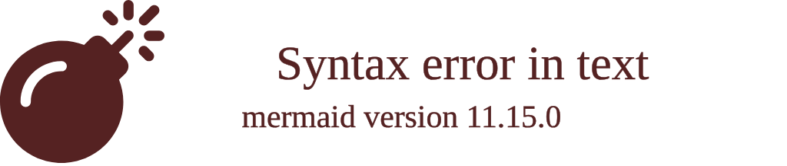

> ⚠️🏗️🚧🦺🧱🪵🪨🪚🛠️👷
> 
> This is a working draft in progress
> 
> 
>
> gif image is provided by [Giphy](https://giphy.com)
> 
> ⚠️🏗️🚧🦺🧱🪵🪨🪚🛠️👷

----

# Nikola Tesla's Lectures

Click to show/hide the full disclaimer.

   
> <ins>📢 **Disclaimer** 🚨</ins>
>
> This document contains my personal notes on the topic,
> compiled from publicly available documentation and various cited sources.
> The materials are intended for educational purposes (<ins>sometimes, entertainment purposes</ins>), personal study, and reference.
> The content is dual-licensed:
> 1. **MIT License:** Applies to all code implementations (Swift, Mermaid, and other programming languages).
> 2. **Creative Commons Attribution-ShareAlike 4.0 International License (CC BY-SA 4.0):** Applies to all non-code content, including text, explanations, diagrams, and illustrations.

---

## Nikola Tesla's Landmark Lectures 🎤

Nikola Tesla delivered numerous groundbreaking lectures throughout his career, showcasing his revolutionary ideas and experiments. The provided list highlights ten such pivotal presentations.

----

## 📜 Lecture Overview and Timeline

Here's a chronological look at Tesla's lectures from the original reference document, noting their primary topics and locations. Tesla's work often revolved around **Alternating Currents (AC)** and **High-Frequency Phenomena**.

A fundamental concept in AC is the sinusoidal voltage, which can be expressed as:
$$ V(t) = V_{\text{peak}} \sin(2\pi f t + \phi) $$
Where:
-   $V(t)$ is the instantaneous voltage at time $t$.
-   $V_{\text{peak}}$ is the maximum voltage.
-   $f$ is the frequency in Hertz (Hz).
-   $\phi$ is the phase angle.

High frequency, a cornerstone of Tesla's research, relates to a short period ($T$) of oscillation, as $f = 1/T$. His experiments often involved resonant circuits, where the natural frequency $f_0$ (e.g., in a series RLC circuit) is given by:
$$ f_0 = \frac{1}{2\pi\sqrt{LC}} $$
Where $L$ is inductance and $C$ is capacitance.

The following Gantt chart visualizes the timeline of these lectures:

```mermaid
---
title: "Key Milestones - History and Evolution of macOS"
author: "Cong Le"
version: "1.0"
license(s): "MIT, CC BY-SA 4.0"
copyright: "Copyright (c) 2025 Cong Le. All Rights Reserved."
config:
  layout: elk
  theme: base
---
%%%%%%%% Mermaid version v11.4.1-b.14
%%{
  init: {
	'fontFamily': 'Bradley Hand',
    'gantt': {
			'useWidth': 900,
      'titleTopMargin': 25,
      'barHeight': 20,
      'barGap': 4,
      'topPadding': 75,
      'rightPadding': 75,
      'leftPadding': 75,
      'gridLineStartPadding': 35,
      'sectionFontSize': 14,
      'numberSectionStyles': 4,
      'axisFormat': '%Y'
    },
    'themeVariables': {
      'primaryColor': '#C80004',
      'primaryTextColor': '#2BB',
      'lineColor': '#F8B229',
      'primaryBorderColor': '#27AE60',
      'secondaryColor': '#EBDEF0',
      'secondaryTextColor': '#6C3483',
      'secondaryBorderColor': '#A569BD',
      'fontSize': '20px'
    }
  }
}%%
gantt
    title Nikola Tesla's Key Lectures Timeline 🗓️
    dateFormat YYYY-MM-DD
    axisFormat %Y

    section Lectures 1888-1893
    A new system of alternate current motors and transformers (L1) :lec1, 1888-05-16, 1d
    Experiments with alternate currents of very high frequency... (L2) :lec2, 1891-05-20, 1d
    Experiments with alternate currents of high potential and high frequency (L3) :lec3, 1892-02-03, 2d
    On light and other high frequency phenomena (L4) :lec4, 1893-02-24, 6d
    On mechanical and electrical oscillators (L5) [Manuscript Lost 💔] :lec5, 1893-08-25, 1d

    section Lectures 1897-1911
    High-frequency oscillators and controls for electric circuits (L7) :lec7, 1897-04-06, 1d
    High frequency oscillators for electrotherapeutic and other purposes (L6) :lec6, 1898-09-13, 1d
    On the art of teleautomatics (L8) [Incomplete Manuscript 📝] :lec8, 1899-05-13, 1d
    The phenomenon of high frequencies (L9) :lec9, 1901-04-12, 1d
    New inventions by Tesla (L10) :lec10, 1911-05-15, 1d
```

*(Note: Lecture L7 (1897) is listed chronologically before L6 (1898) despite their numbering in the source document.)*

----

## 🌍 Geographical Journey of Lectures

Tesla presented his findings in prominent scientific and engineering circles across North America and Europe.

```mermaid
---
title: "🌍 Geographical Journey of Lectures"
author: "Cong Le"
version: "1.0"
license(s): "MIT, CC BY-SA 4.0"
copyright: "Copyright (c) 2025 Cong Le. All Rights Reserved."
config:
  layout: elk
  theme: base
  look: handDrawn
---
%%%%%%%% Mermaid version v11.4.1-b.14
%%%%%%%% Available curve styles include the following keywords:
%% basis, bumpX, bumpY, cardinal, catmullRom, linear, monotoneX, monotoneY, natural, step, stepAfter, stepBefore.
%%{
  init: {
    'flowchart': { 'htmlLabels': true, 'curve': 'basis' },
    'fontFamily': 'American Typewriter, monospace',
    'logLevel': 'fatal',
    'themeVariables': {
      'primaryColor': '#22BB',
      'primaryTextColor': '#F8B229',
      'lineColor': '#F8B229',
      'primaryBorderColor': '#27AE60',
      'secondaryColor': '#E2F1',
      'secondaryTextColor': '#6C3483',
      'secondaryBorderColor': '#A569BD',
      'fontSize': '20px'
    }
  }
}%%
flowchart TD
    subgraph North_America["North America 🇺🇸"]
    style North_America fill:#D2F8,stroke:#333,stroke-width:1px, color: #FFFF
        N1["New York<br/>(1888, L1)"] --> N2["New York<br/>(1891, L2)"]
        N2 --> P1["Philadelphia<br/>(1893, L4)"]
        P1 --> S1["St. Louis<br/>(1893, L4)"]
        S1 --> C1["Chicago<br/>(1893, L5)"]
        C1 --> N3["New York<br/>(1897, L7)"]
        N3 --> B1["Buffalo<br/>(1898, L6)"]
        B1 --> C2["Chicago<br/>(1899, L8)"]
        C2 --> N4["New York<br/>(1901, L9)"]
        N4 --> N5["New York<br/>(1911, L10)"]
    end

    subgraph Europe["Europe 🇪🇺"]
    style Europe fill:#2F33,stroke:#333,stroke-width:1px, color: #FFFF
        LNY["New York<br/>(Starting Point for some European Tours)"] -.-> LON["London<br/>(1892, L3) ✨"]
        LON --> PAR["Paris<br/>(1892, L3) ✨"]
    end

    style N1 fill:#EAF8,stroke:#333,stroke-width:2px
    style N2 fill:#EAF8,stroke:#333,stroke-width:2px
    style N3 fill:#EAF8,stroke:#333,stroke-width:2px
    style N4 fill:#EAF8,stroke:#333,stroke-width:2px
    style N5 fill:#EAF8,stroke:#333,stroke-width:2px
    style P1 fill:#F5E3,stroke:#333,stroke-width:2px
    style S1 fill:#F5E3,stroke:#333,stroke-width:2px
    style C1 fill:#F3CF,stroke:#333,stroke-width:2px
    style C2 fill:#FCF2,stroke:#333,stroke-width:2px
    style B1 fill:#DEF0,stroke:#333,stroke-width:2px
    style LON fill:#EEC2,stroke:#333,stroke-width:2px
    style PAR fill:#EDC2,stroke:#333,stroke-width:2px
```

----

## 💡 Core Themes in Tesla's Lectures

Several key themes permeated Tesla's lectures, demonstrating the breadth and depth of his research.

```mermaid
---
title: "Core Themes in Tesla's Lectures"
author: "Cong Le"
version: "1.0"
license(s): "MIT, CC BY 4.0"
copyright: "Copyright (c) 2025 Cong Le. All Rights Reserved."
config:
  theme: base
---
%%%%%%%% Mermaid version v11.4.1-b.14
%%{
  init: {
    'fontFamily': 'Monaco',
    'themeVariables': {
      'primaryColor': '#FC82',
      'primaryTextColor': '#F8B229',
      'primaryBorderColor': '#27AE60',
      'secondaryColor': '#EBF3',
      'secondaryTextColor': '#6C3483',
      'secondaryBorderColor': '#A569BD',
      'fontSize': '20px'
    }
  }
}%%
mindmap
  root)"**Tesla's Lecture Themes** ⚡"(
    Alternate_Currents))"**Alternate Currents**<br/>(**AC**)"((
      ::icon(fas fa-bolt)
      Motors_and_Transformers{{"Motors & Transformers<br/>(L1)"}}
      High_Frequency_Applications{{"High Frequency Applications<br/>(L2, L3)"}}
    High_Frequency_Phenomena))"**High Frequency Phenomena**"((
      ::icon(fas fa-wave-square)
      Artificial_Illumination{{"Artificial Illumination<br/>(L2, L4)"}}
      High_Potential_Effects{{"High Potential Effects<br/>(L3)"}}
      General_Phenomena{{"General Phenomena<br/>(L4, L9)"}}
      Electrotherapeutics{{"Electrotherapeutics<br/>(L6)"}}
      Circuit_Controls{{"Circuit Controls<br/>(L7)"}}
    Oscillators))"**Oscillators**"((
      ::icon(fas fa-broadcast-tower)
      Mechanical_and_Electrical{{"Mechanical & Electrical<br/>(L5)"}}
      Electrotherapeutic_and_Other{{"Electrotherapeutic & Other<br/>(L6)"}}
      Circuit_Controls{{"Circuit Controls<br/>(L7)"}}
    Artificial_Illumination))"**Artificial Illumination** 💡"((
      High_Frequency_Methods{{"High Frequency Methods<br/>(L2)"}}
      Light_and_Other Phenomena{{"Light & Other Phenomena<br/>(L4)"}}
    Teleautomatics))"**Teleautomatics** 🤖"((
      The_Art_Of{{"The Art Of<br/>(L8)"}}
    New_Inventions))"New Inventions (General) 🚀"((
      Updates_and_Showcases{{"Updates & Showcases<br/>(L10)"}}
```

----

## 📚 Status of Lecture Materials

The preservation of Tesla's lecture materials varies.

*   **Lecture 5 ("On mechanical and electrical oscillators")**: The manuscript was unfortunately not preserved and is believed to have been destroyed in the laboratory fire of March 13, 1895. 😥
*   **Lecture 8 ("On the art of teleautomatics")**: This lecture is preserved in an incomplete and unfinished form.

---

## Nikola Tesla Museum 🏛️

The Nikola Tesla Museum in Belgrade, Serbia, is dedicated to honoring and displaying the life and work of Nikola Tesla.

### ℹ️ Museum Information (English & Српски)

Here's a summary of key visitor information, presented bilingually as in the source.

```mermaid
---
title: "ℹ️ Museum Information (English & Српски)"
author: "Cong Le"
version: "1.0"
license(s): "MIT, CC BY-SA 4.0"
copyright: "Copyright (c) 2025 Cong Le. All Rights Reserved."
config:
  layout: elk
  theme: base
  look: handDrawn
---
%%%%%%%% Mermaid version v11.4.1-b.14
%%%%%%%% Available curve styles include the following keywords:
%% basis, bumpX, bumpY, cardinal, catmullRom, linear, monotoneX, monotoneY, natural, step, stepAfter, stepBefore.
%%{
  init: {
    'flowchart': { 'htmlLabels': true, 'curve': 'basis' },
    'fontFamily': 'American Typewriter, monospace',
    'logLevel': 'fatal',
    'themeVariables': {
      'primaryColor': '#22BB',
      'primaryTextColor': '#F8B229',
      'lineColor': '#F8B229',
      'primaryBorderColor': '#27AE60',
      'secondaryColor': '#E2F1',
      'secondaryTextColor': '#6C3483',
      'secondaryBorderColor': '#A569BD',
      'fontSize': '20px'
    }
  }
}%%
flowchart LR
  subgraph Museum["Nikola Tesla Museum /<br/> Музеј Николе Тесле"]
  style Museum fill:#f9f2,stroke:#333,stroke-width:4px, color: #FFFF

    subgraph Visit_EN["🌍 Plan Your Visit<br/>(English)"]
    style Visit_EN fill:#f9f2,stroke:#333,stroke-width:1px, color: #F8B229
    direction LR
      OH_EN["🕒 Opening Hours"] --> OH_Details_EN["Monday: 10:00-18:00<br/>Tuesday-Sunday: 10:00-20:00"]
      
      CI_EN["📞 Contact Info"] --> CI_Details_EN["+381 11 2433 886<br/>+381 11 2438 137<br/>poseta@tesla-museum.org<br/>(Mon-Fri 10:00-15:00 for calls)"]
      
      GT_EN["🚶 Guided Tours"] --> GT_Links_EN["<a href='https://tesla-museum.org/en/visit/plan-your-visit/'>Plan Your Visit</a><br/><a href='https://tesla-museum.org/en/visit/plan-your-visit/#guided-tour'>Guided Tour Schedule</a><br/><a href='https://tesla-museum.org/en/visit/plan-your-visit/#book-tour'>Book a Guided Tour</a>"]
        end

    subgraph Visit_SR["🇷🇸 Планирајте посету<br/>(Српски)"]
    style Visit_SR fill:#f922,stroke:#333,stroke-width:1px, color: #F8B229
    direction LR
      OH_SR["🕒 Радно време"] --> OH_Details_SR["понедељак: 10:00-18:00<br/>уторак-недеља: 10:00-20:00"]
      
      CI_SR["📞 Контакт инфо"] --> CI_Details_SR["011/2433-886<br/>011/2438-137<br/>poseta@tesla-museum.org<br/>(понедељак-петак 10:00-15:00 за позиве)"]
      
      GT_SR["🚶 Туре са водичем"] --> GT_Links_SR["<a href='https://tesla-museum.org/poseta/planirajte-posetu'>Планирајте посету</a><br/><a href='https://tesla-museum.org/poseta/planirajte-posetu/#tura-sa-vodicem'>Распоред тура</a><br/><a href='https://tesla-museum.org/poseta/planirajte-posetu/#rezervisite-turu'>Резервишите групну туру</a>"]
        end
    end
```

---

This exploration aims to give a clearer, more visual understanding of the significant contributions Tesla shared through his lectures and how his legacy is preserved today. ✨🔬

----

<!-- 

---
><b>Licenses</b>:
>
>- <b>MIT License</b>:   - Full text in [LICENSE](LICENSE) file.
>- <b>Creative Commons Attribution-ShareAlike 4.0 International</b>: [CC BY-SA 4.0](https://creativecommons.org/licenses/by-sa/4.0/)  - Legal details in [LICENSE-CC-BY-SA-4.0](THE_PAST/LICENSE-CC-BY-SA-4.0) and at [Creative Commons official site](https://creativecommons.org/licenses/by-sa/4.0/).
>
---

**Citation:**
All information regarding Tesla's lectures and the Nikola Tesla Museum is sourced from the [Nikola Tesla Museum website](https://tesla-museum.org/en/nikola-tesla-2/lectures/). Please visit their official website for the most current details.

----
