> ⚠️🏗️🚧🦺🧱🪵🪨🪚🛠️👷
> 
> This is a working draft in progress
> 
> 
>
> gif image is provided by [Giphy](https://giphy.com)
> 
> ⚠️🏗️🚧🦺🧱🪵🪨🪚🛠️👷

----

#  Nikola Tesla's USA Patents Timeline

Click to show/hide the full disclaimer.

> <ins>📢 **Disclaimer** 🚨</ins>
>
> This project is born from my fascination with blending digital art and artificial intelligence. 
> It's where I document my academic explorations, 
> share my findings with anyone interested, 
> and maintain a personal vault of my creative and technical journey. 
> I'm not sure the link for this repo being shared in the back by others, 
> since I havent plan for any analytics for this project yet. 
> ...and I'm actively looking for a job... 

> This document contains my personal notes on the topic, 
> compiled from publicly available documentation and various cited sources.
> 
> The materials are intended for educational purposes (<ins>sometimes, entertainment purposes</ins>), personal study, and technical reference.
> The content is dual-licensed:
> 1. **MIT License:** Applies to all code implementations (Swift, Mermaid, and other programming languages).
> 2. **Creative Commons Attribution-ShareAlike 4.0 International License (CC BY-SA 4.0):** Applies to all non-code content, including text, explanations, diagrams, and illustrations.

---

🕰️ Below is the Mermaid Gantt chart representing all 112 U.S. patents granted to Nikola Tesla, based on the provided document. The timeline uses the "Filing Date" and "Grant Date" as listed for each patent entry.

The patents are sectioned by the decade in which they were granted to improve readability.

```mermaid
---
title: "Nikola Tesla's USA Patents Timeline"
author: "Cong Le"
version: "1.0"
license(s): "MIT, CC BY-SA 4.0"
copyright: "Copyright (c) 2025 Cong Le. All Rights Reserved."
config:
  layout: elk
  theme: base
---
%%%%%%%% Mermaid version v11.4.1-b.14
%%{
  init: {
	'fontFamily': 'Bradley Hand',
    'gantt': {
      'titleTopMargin': 25,
      'barHeight': 15,
      'barGap': 10,
      'topPadding': 65,
      'rightPadding': 10,
      'leftPadding': 200,
      'gridLineStartPadding': 25,
      'sectionFontSize': 15,
      'numberSectionStyles': 4,
      'axisFormat': '%Y',
      'topAxis': true,
      'weekday': 'sunday'
    },
    'themeVariables': {
      'primaryColor': '#C004',
      'primaryTextColor': '#F8B229',
      'primaryBorderColor': '#27AE60',
      'fontSize': '20px'
    }
  }
}%%
gantt
    dateFormat  YYYY-MM-DD
    title Nikola Tesla's USA Patents Timeline 📜🇺🇸

    section Patents Granted in the 1880s
    Electric-Arc Lamp (US335,786)                                    :active, p1, 1885-03-30, 1886-02-09
    Commutator for Dynamo-Electric Machines (US334,823)              :active, p2, 1885-05-06, 1886-01-26
    Regulator for Dynamo-Electric Machines (US336,961)               :active, p3, 1885-05-18, 1886-03-02
    Regulator for Dynamo-Electric Machines (US336,962)               :active, p4, 1885-06-01, 1886-03-02
    Electric-Arc Lamp (US335,787)                                    :active, p5, 1885-07-13, 1886-02-09
    Dynamo-Electric Machine (US359,748)                              :active, p6, 1886-01-14, 1887-03-22
    Regulator for Dynamo-Electric Machines (US350,954)               :active, p7, 1886-01-14, 1886-10-19
    Thermo-Magnetic Motor (US396,121)                                :active, p8, 1886-03-30, 1889-01-15
    Commutator for Dynamo-Electric Machines (US382,845)              :active, p9, 1887-04-30, 1888-05-15
    Pyromagneto-Electric Generator (US428,057)                       :active, p10, 1887-05-26, 1890-05-13
    Electro-Magnetic Motor (US381,968)                               :active, p11, 1887-10-12, 1888-05-01
    Electrical Transmission of Power (US382,280)                     :active, p12, 1887-10-12, 1888-05-01
    Electro-Magnetic Motor (US382,279)                               :active, p13, 1887-11-30, 1888-05-01
    Electro-Magnetic Motor (US381,969)                               :active, p14, 1887-11-30, 1888-05-01
    Electrical Transmission of Power (US382,281)                     :active, p15, 1887-11-30, 1888-05-01
    System of Electrical Distribution (US382,282)                    :active, p16, 1887-12-23, 1888-05-01
    Method of Converting and Distributing Electric Currents (US381,970) :active, p17, 1887-12-23, 1888-05-01
    System of Electrical Distribution (US390,413)                    :active, p18, 1888-04-10, 1888-10-02
    Dynamo-Electric Machine (US390,414)                              :active, p19, 1888-04-23, 1888-10-02
    Regulator for Alternate-Current Motors (US390,820)               :active, p20, 1888-04-24, 1888-10-09
    Dynamo-Electric Machine (US390,721)                              :active, p21, 1888-04-28, 1888-10-09
    Dynamo-Electric Machine or Motor (US390,415)                     :active, p25, 1888-05-15, 1888-10-02
    Method of Operating Electro-Magnetic Motors (US405,858)          :active, p30, 1889-02-18, 1889-06-25
    Method of Electrical Power Transmission (US401,520)              :active, p31, 1889-03-14, 1889-04-16
    Dynamo-Electric Machine (US405,859)                              :active, p32, 1889-03-23, 1889-06-25
    Electro-Magnetic Motor (US406,968)                               :active, p33, 1889-04-06, 1889-07-16
    Method of Obtaining Direct from Alternating Currents (US413,353) :active, p42, 1889-06-12, 1889-10-22
    Armature for Electric Machines (US417,794)                       :active, p43, 1889-06-28, 1889-12-24
    Electro-Magnetic Motor (US416,191)                               :active, p36, 1889-05-20, 1889-12-03
    Electro-Magnetic Motor (US416,192)                               :active, p37, 1889-05-20, 1889-12-03
    Electro-Magnetic Motor (US416,193)                               :active, p38, 1889-05-20, 1889-12-03
    Electro-Magnetic Motor (US416,194)                               :active, p40, 1889-05-20, 1889-12-03
    Electro-Magnetic Motor (US416,195)                               :active, p41, 1889-05-20, 1889-12-03
    Electric Motor (US418,248)                                       :active, p39, 1889-05-20, 1889-12-31

    section Patents Granted in the 1890s
    Alternating-Current Electro-Magnetic Motor (US433,700)           :active, p44, 1890-03-26, 1890-08-05
    Alternating-Current Motor (US433,701)                            :active, p45, 1890-03-26, 1890-08-05
    Electrical Transformer or Induction Device (US433,702)           :active, p46, 1890-03-26, 1890-08-05
    Electro-Magnetic Motor (US433,703)                               :active, p47, 1890-04-04, 1890-08-05
    
    %% Below is the patent 39 in the list with a new grant date and patent number, listed title "Electric Motor"
    Electric Motor (US424,036)                                       :active, p39_variant, 1889-05-20, 1890-03-25
    
    Method of Operating Arc Lamps (US447,920)                        :active, p48, 1890-10-01, 1891-03-10
    Alternating-Electric-Current Generator (US447,921)               :active, p49, 1890-11-15, 1891-03-10
    Method of Operating Electro-Magnetic Motors (US459,772)          :active, p35, 1889-05-20, 1891-09-22
    
    %% Below is patent 40 in the list referring to same filing, new grant/patent - using p40_variant
    Electro-Magnetic Motor (US445,207)                               :active, p40_variant, 1889-05-20, 1891-01-27

    System of Electric Lightning (US454,622)                         :active, p53, 1891-04-26, 1891-06-23
    Electro-Magnetic Motor (US455,067)                               :active, p50, 1891-01-27, 1891-06-30
    Method of and Apparatus for Electrical Conversion and Distribution (US462,418) :active, p51, 1891-02-04, 1891-11-03
    Electrical Meter (US455,068)                                     :active, p52, 1891-03-27, 1891-06-30
    Electric Incandescent Lamp (US455,069)                           :active, p54, 1891-05-14, 1891-06-30
    Electro-Magnetic Motor (US464,666)                               :active, p55, 1891-07-13, 1891-12-08
    Electrical Condenser (US464,667)                                 :active, p56, 1891-08-01, 1891-12-08
    System of Electrical Transmission of Power (US487,796)           :active, p22, 1888-05-15, 1892-12-13
    Electro-Magnetic Motor (US511,915)                               :active, p26, 1888-10-20, 1894-01-02
    Electrical Transmission of Power (US524,426)                     :active, p24, 1888-05-15, 1894-08-14
    System of Electrical Power Transmission (US511,559)              :active, p28, 1888-12-08, 1893-12-26
    Electro-Magnetic Motor (US511,560)                               :active, p29, 1888-12-08, 1893-12-26
    Incandescent Electric Light (US514,170)                          :active, p57, 1892-01-02, 1894-02-06
    Electrical Conductor (US514,167)                                 :active, p58, 1892-01-02, 1894-02-06
    Electric Railway Systems (US514,972)                             :active, p59, 1892-01-02, 1894-02-20
    Steam Engine (US512,340)                                         :active, p65, 1893-12-29, 1894-01-09
    Coil for Electro-Magnets (US514,168)                             :active, p60, 1893-07-07, 1894-02-06
    Means for Generating Electric Currents (US511,916)               :active, p61, 1893-08-02, 1894-01-02
    Electric Generator (US514,169)                                   :active, p62, 1893-08-19, 1894-02-06
    Reciprocating Engine (US514,973)                                 :active, p63, 1893-08-19, 1894-02-20
    Electrical Meter (US517,900)                                     :active, p64, 1893-12-15, 1894-04-10
    Alternating Motor (US555,190)                                    :active, p23, 1888-05-15, 1896-02-25
    Apparatus for Producing Electric Currents of High Frequency and Potential (US568,176) :active, p66, 1896-04-22, 1896-09-22
    Apparatus for Producing Ozone (US568,177)                        :active, p67, 1896-06-17, 1896-09-22
    Electrical Condenser (US567,818)                                 :active, p68, 1896-06-17, 1896-09-15
    Method of Regulating Apparatus for Producing Currents of High Frequency (US568,178) :active, p69, 1896-06-20, 1896-09-22
    Method of and Apparatus for Producing Currents of High Frequency (US568,179) :active, p70, 1896-07-06, 1896-09-22
    Apparatus for Producing Electrical Currents of High Frequency (US568,180) :active, p71, 1896-07-09, 1896-09-22
    Apparatus for Producing Electric Currents of High Frequency (US577,670) :active, p72, 1896-09-03, 1897-02-23
    Apparatus for Producing Currents of High Frequency (US583,953)   :active, p73, 1896-10-19, 1897-06-08
    Manufacture of Electrical Condensers, Coils etc. (US577,671)     :active, p74, 1896-11-05, 1897-02-23
    Electrical Igniter for Gas-Engines (US609,250)                   :active, p75, 1897-02-17, 1898-08-16
    Electrical Transformer (US609,251)                               :active, p76, 1897-03-20, 1898-08-16
    Electric-Circuit Controller (US593,138)                          :active, p77, 1897-06-03, 1897-11-02
    Electrical-Circuit Controller (US609,245)                        :active, p80, 1897-12-02, 1898-08-16
    Electrical-Circuit Controller (US611,719)                        :active, p81, 1897-12-10, 1898-10-04
    Electrical-Circuit Controller (US609,246)                        :active, p82, 1898-02-28, 1898-08-16
    Electric-Circuit Controller (US609,247)                          :active, p83, 1898-03-12, 1898-08-16
    Electric-Circuit Controller (US609,248)                          :active, p84, 1898-03-12, 1898-08-16
    Electric-Circuit Controller (US609,249)                          :active, p85, 1898-03-12, 1898-08-16
    Electric-Circuit Controller (US613,735)                          :active, p86, 1898-04-19, 1898-11-08
    Method of and Apparatus for Controlling the Mechanism of Moving Vessels or Vehicles (US613,809) :active, p87, 1898-07-01, 1898-11-08

    section Patents Granted in the 1900s
    System of Transmission of Electrical Energy (US645,576)          :active, p78, 1897-09-02, 1900-03-20
    Apparatus for Transmission of Electrical Energy (US649,621)      :active, p79, 1897-09-02, 1900-05-15
    Method of Insulating Electric Conductors (Reissued) (US11,865)   :active, p97, 1900-09-21, 1900-10-23
    Method of Intensifying and Utilizing Effects Transmitted through Natural Media (US685,953) :active, p88, 1899-06-24, 1901-11-05
    Apparatus for Utilizing Effects Transmitted from a Distance to a Receiving Device through Natural Media (US685,955) :active, p89, 1899-06-24, 1901-11-05
    Method of Utilizing Effects Transmitted through the Natural Media (US685,954) :active, p90, 1899-08-01, 1901-11-05
    Apparatus for Utilizing Effects Transmitted through Natural Media (US685,956) :active, p91, 1899-08-01, 1901-11-05
    Means for Increasing the Intensity of Electrical Oscillations (US685,012) :active, p92, 1900-03-21, 1901-10-22
    Methods of Insulating Electric Conductors (US655,838)            :active, p94, 1900-06-15, 1900-08-14
    Apparatus for Utilization of Radiant Energy (US685,957)          :active, p98, 1901-03-21, 1901-11-05
    Method of Utilizing Radiant Energy (US685,958)                   :active, p99, 1901-03-21, 1901-11-05
    System of Signaling (US723,188)                                  :active, p95, 1900-07-16, 1903-03-17
    Method of Signaling (US725,605)                                  :active, p96, 1900-07-16, 1903-04-14
    Art of Transmitting Electrical Energy through the Natural Mediums (US787,412) :active, p93, 1900-05-16, 1905-04-18

    section Patents Granted in the 1910s
    Apparatus for Transmitting Electrical Energy (US1,119,732)       :active, p100, 1902-01-18, 1914-12-01
    Fluid Propulsion (US1,061,206)                                   :active, p101, 1909-10-21, 1913-05-06
    Turbine (US1,061,142)                                            :active, p102, 1909-10-21, 1913-05-06
    Fountain (US1,113,716)                                           :active, p103, 1913-10-28, 1914-10-13
    Speed-Indicator (US1,209,359)                                    :active, p104, 1914-05-29, 1916-12-19
    Lightning Protector (US1,266,175)                                :active, p106, 1916-05-06, 1918-05-14
    Ship's Log (US1,314,718)                                         :active, p109, 1916-12-18, 1919-09-02
    Speed-Indicator (US1,274,816)                                    :active, p110, 1916-12-18, 1918-08-06

    section Patents Granted in the 1920s
    Valvular Conduit (US1,329,559)                                   :active, p105, 1916-02-21, 1920-02-03
    Flow Meter (US1,365,547)                                         :active, p107, 1916-12-18, 1921-01-11
    Frequency Meter (US1,402,025)                                    :active, p108, 1916-12-18, 1922-01-03
    Method of Aerial Transportation (US1,655,113)                    :active, p111, 1921-09-09, 1928-01-03
    Apparatus for Aerial Transportation (US1,655,114)                :active, p112, 1921-09-09, 1928-01-03
```

----

**Note on Patent 39 and 40:**
The document lists "Electric Motor" (Serial 39, original Patent 418,248) and "Electro-Magnetic Motor" (Serial 40, original Patent 416,194) and then later shows the same serial numbers 39 and 40 with different patent numbers (424,036 and 445,207 respectively) and grant dates but identical filing dates and titles. I've represented these potentially re-issued or distinct grants with `_variant` in their Mermaid IDs for clarity in construction, though the timeline simply lists them. The titles in the list are sometimes slightly different ("Electric Motor" vs "Electro-Magnetic Motor") for these re-entries. I've used the title as listed on *that particular line item* in the document for the specific patent number. For instance, serial 39 is first listed as "Electric Motor" (418,248) and then referenced again (still serial 39 in the running list of 112 patent events) as "Electric Motor" (424,036). I've used `p39_variant` for the ID of the second instance to avoid Mermaid ID collision if it were an issue (Mermaid itself is fine with duplicate labels if IDs are unique).

---

<!-- 

---
><b>Licenses</b>:
>
>- <b>MIT License</b>:   - Full text in [LICENSE](LICENSE) file.
>- <b>Creative Commons Attribution-ShareAlike 4.0 International</b>: [CC BY-SA 4.0](https://creativecommons.org/licenses/by-sa/4.0/)  - Legal details in [LICENSE-CC-BY-SA-4.0](THE_PAST/LICENSE-CC-BY-SA-4.0) and at [Creative Commons official site](https://creativecommons.org/licenses/by-sa/4.0/).
>
---
