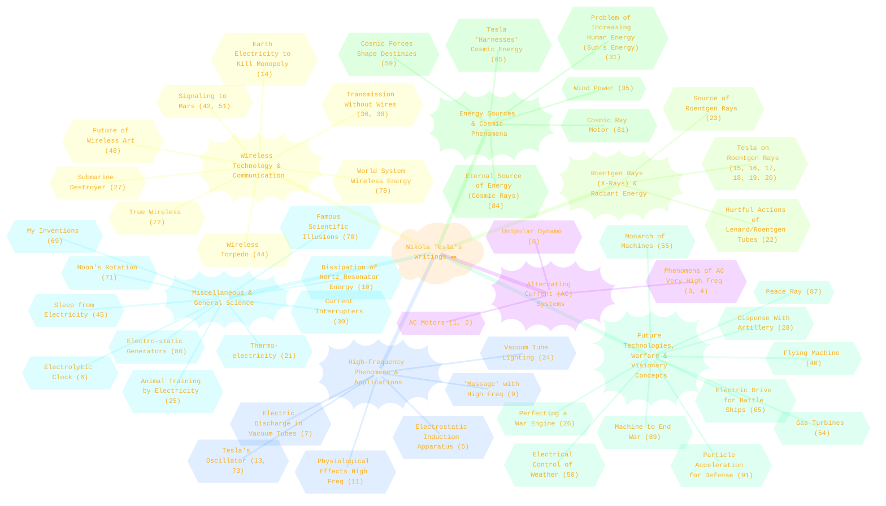
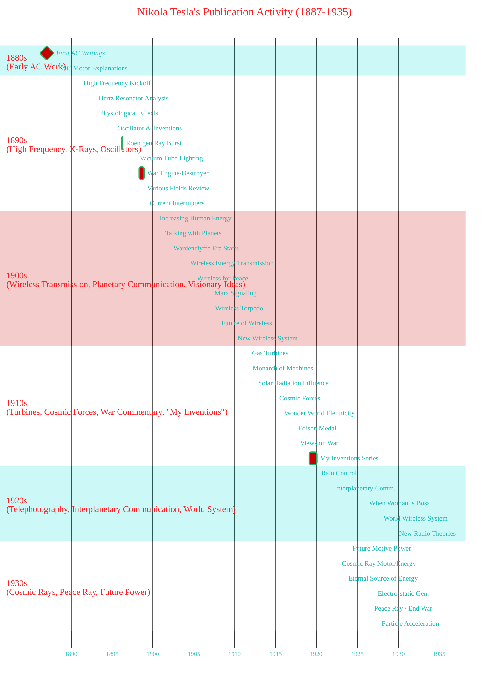
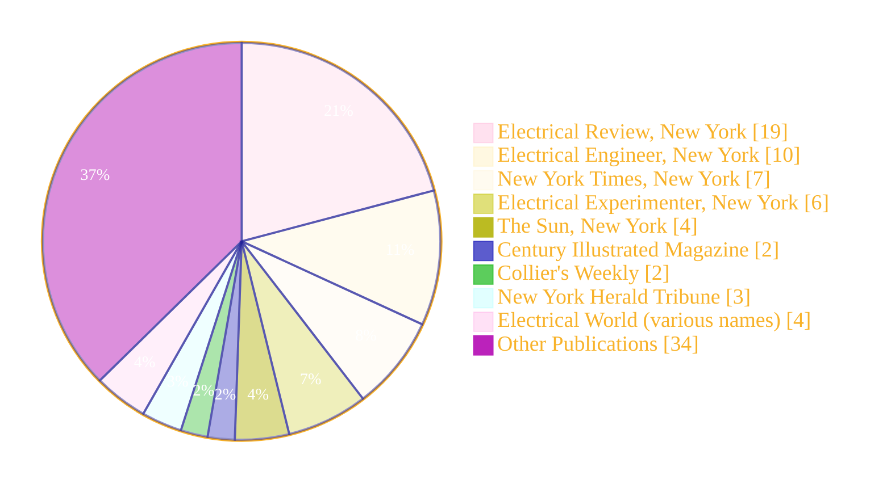

> ⚠️🏗️🚧🦺🧱🪵🪨🪚🛠️👷
> 
> This is a working draft in progress
> 
> 
>
> gif image is provided by [Giphy](https://giphy.com)
> 
> ⚠️🏗️🚧🦺🧱🪵🪨🪚🛠️👷

----

# Nikola Tesla's Writings

Click to show/hide the full disclaimer.

   
> <ins>📢 **Disclaimer** 🚨</ins>
>
> This document contains my personal notes on the topic,
> compiled from publicly available documentation and various cited sources.
> The materials are intended for educational purposes (<ins>sometimes, entertainment purposes</ins>), personal study, and reference.
> The content is dual-licensed:
> 1. **MIT License:** Applies to all code implementations (Swift, Mermaid, and other programming languages).
> 2. **Creative Commons Attribution-ShareAlike 4.0 International License (CC BY-SA 4.0):** Applies to all non-code content, including text, explanations, diagrams, and illustrations.

---

## 🌌 Nikola Tesla's Intellectual Universe: A Thematic Overview

Tesla's writings reveal a mind constantly exploring the frontiers of science and technology. We can group his publications into several key themes. The following mind map illustrates these major areas of his research and public discourse:

*(Numbers in parentheses refer to the item number in the provided list of writings)*

This map highlights the diverse yet interconnected nature of Tesla's interests, from the foundational work on AC power to speculative ideas about cosmic energy and global communication. 💡

---

## ⏳ Timeline of Tesla's Publications: A Decade-by-Decade Look

Visualizing the timeline of Tesla's publications can show periods of intense activity and shifts in focus. Below is a Gantt chart summarizing his output. Due to the large number of publications, we'll represent activity per year rather than individual articles for brevity, focusing on decades.

This timeline provides a glimpse into the evolution of his public communications. The 1890s were particularly rich in foundational work on high-frequency phenomena and his initial Roentgen ray investigations. The 1900s saw a strong focus on wireless technologies, while later decades included more visionary concepts and reflections. 🚀

---

## 📰 Publication Venues: Where Tesla Shared His Ideas

Tesla published his work in a variety of scientific journals, magazines, and newspapers. The following pie chart shows the distribution among some of the most frequent outlets:

*(Counts are approximate based on the provided list and may group similar journal names.)*

This shows that "Electrical Review" and "Electrical Engineer" were significant platforms for his technical articles, while major newspapers like the "New York Times" helped disseminate his broader visions and announcements to the public. 📢

---

## 🔬 Key Concepts & Related Mathematical Ideas

While the provided list doesn't detail the mathematical content of each article, Tesla's work was deeply rooted in the principles of electricity and magnetism. Here are some fundamental concepts and related equations relevant to his areas of research:

### 1. Alternating Current (AC) ⚡
Tesla championed AC power. Key characteristics include:
*   **Voltage and Current as Sinusoids:**

$$V(t) = V_p \sin(\omega t + \phi_V)$$

$$I(t) = I_p \sin(\omega t + \phi_I)$$

Where $V_p, I_p$ are peak voltage/current, $\omega = 2\pi f$ is angular frequency ($f$ is frequency), and $\phi$ is the phase angle.

*   **Impedance (Z):** The total opposition to current flow in an AC circuit. For a series RLC circuit:

$$Z = \sqrt{R^2 + (X_L - X_C)^2}$$

Where $X_L = \omega L$ is inductive reactance and $X_C = \frac{1}{\omega C}$ is capacitive reactance.

*   **Polyphase Systems:** Tesla's induction motor and power distribution systems relied heavily on polyphase currents (typically three-phase), which provide smoother power delivery and rotating magnetic fields. For a balanced three-phase system, the phases are $120^\circ$ apart:

$$V_A(t) = V_p \sin(\omega t)$$

$$V_B(t) = V_p \sin(\omega t - \frac{2\pi}{3})$$

$$V_C(t) = V_p \sin(\omega t - \frac{4\pi}{3})$$

### 2. High-Frequency Phenomena & Resonance (e.g., Tesla Coil) 🌀
Tesla's experiments with high-frequency, high-voltage currents were groundbreaking. The Tesla coil is a resonant transformer.
*   **Resonant Frequency:** For an LC circuit (the basis of oscillators and resonant transformers):

$$f_0 = \frac{1}{2\pi\sqrt{LC}}$$

Adjusting L (inductance) and C (capacitance) "tunes" the circuit. Tesla coils often involve coupled resonant circuits.

*   **Energy in an Oscillator:** Energy oscillates between the inductor's magnetic field ($U_L = \frac{1}{2}LI^2$) and the capacitor's electric field ($U_C = \frac{1}{2}CV^2$).

### 3. Wireless Transmission of Energy & Signals 📡
Tesla dreamed of transmitting power wirelessly on a global scale. This involves electromagnetic waves.
*   **Electromagnetic Waves:** Described by Maxwell's Equations. A simplified wave equation for the electric field $E$:

$$\nabla^2 E - \frac{1}{c^2} \frac{\partial^2 E}{\partial t^2} = 0$$

Where $c$ is the speed of light.

*   **Poynting Vector (S):** Represents the directional energy flux density (power per unit area) of an electromagnetic field:

$$\mathbf{S} = \frac{1}{\mu_0} (\mathbf{E} \times \mathbf{B})$$

Tesla envisioned exciting the Earth's resonant cavity.

### 4. Roentgen Rays (X-Rays) 🦴
Tesla quickly replicated Roentgen's experiments and conducted his own extensive research.
*   **Photon Energy:** X-rays are high-energy photons. Their energy is related to frequency ($f$) and wavelength ($\lambda$):

$$E = hf = \frac{hc}{\lambda}$$

Where $h$ is Planck's constant.
*   **Generation:** Typically by accelerating electrons to high kinetic energy ($KE = qV$) and then rapidly decelerating them (e.g., by collision with a metal target).

### 5. Cosmic Energy 🌌
Tesla spoke of harnessing "cosmic rays" or energy from the environment.
*   While his concepts were not fully aligned with modern physics of cosmic rays (high-energy particles from space), the idea of tapping ambient energy sources remains a compelling, though challenging, scientific pursuit. The most famous equation related to energy and matter, though developed later by Einstein, is:

$$E = mc^2$$

This equation itself wasn't part of Tesla's direct work, but represents the immense energy potential within matter, a concept fitting his grand visions. Tesla's ideas were more about tapping directly into perceived ambient fields or radiation.

---

This overview provides a structured way to appreciate the thematic diversity, chronological development, and conceptual underpinnings of Nikola Tesla's published writings. His work laid the groundwork for many modern technologies and continues to inspire innovation. ✨

----

<!-- 

---
><b>Licenses</b>:
>
>- <b>MIT License</b>:   - Full text in [LICENSE](LICENSE) file.
>- <b>Creative Commons Attribution-ShareAlike 4.0 International</b>: [CC BY-SA 4.0](https://creativecommons.org/licenses/by-sa/4.0/)  - Legal details in [LICENSE-CC-BY-SA-4.0](THE_PAST/LICENSE-CC-BY-SA-4.0) and at [Creative Commons official site](https://creativecommons.org/licenses/by-sa/4.0/).
>
---

**Citation:**
The list of Nikola Tesla's writings is sourced from the Nikola Tesla Museum.
*   Nikola Tesla Museum. "Tesla's Writings." *Nikola Tesla Museum*, [https://tesla-museum.org/en/nikola-tesla-2/writings/](https://tesla-museum.org/en/nikola-tesla-2/writings/). June, 09, 2025.

----
