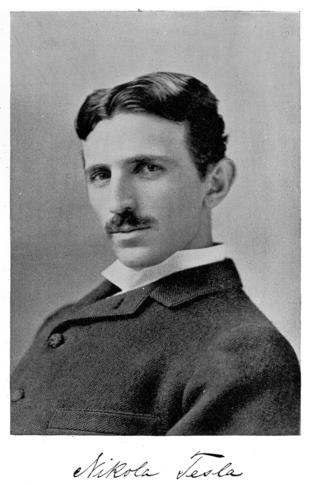
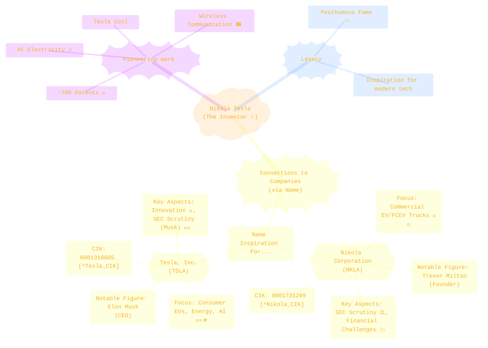
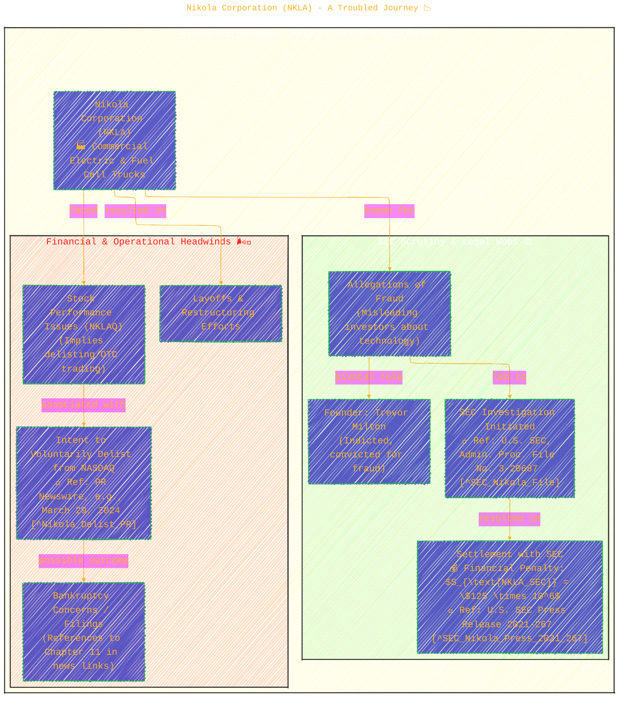
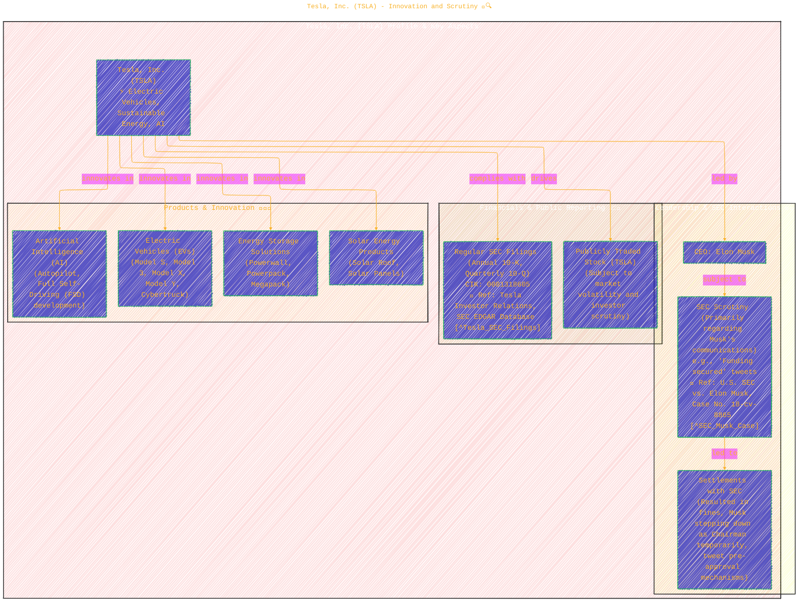
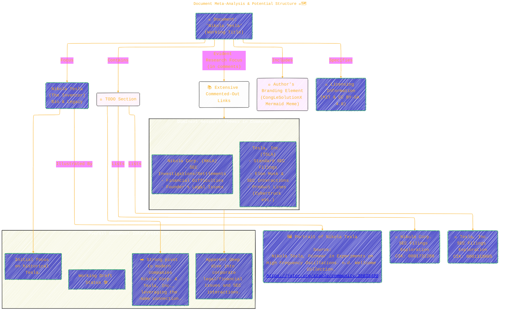

# Nikola Tesla

> ⚠️🏗️🚧🦺🧱🪵🪨🪚🛠️👷
> 
> This is a working draft in progress
> 
> 
>
> gif image is provided by [Giphy](https://giphy.com)
> 
> ⚠️🏗️🚧🦺🧱🪵🪨🪚🛠️👷

----

<!--  -->

<!--  -->

<!-- Option 1:

> Source: 
> _Nikola Tesla, Pioneer in Experiments on High Frequency Oscillations._ n.d. Wellcome Collection. https://jstor.org/stable/community.36635498. -->

<!-- Option 2 -->

 
Source:  <em>Nikola Tesla, Pioneer in Experiments on High Frequency Oscillations. n.d. Wellcome Collection. <a href='https://jstor.org/stable/community.36635498'>https://jstor.org/stable/community.36635498</a></em>

<!-- 
https://www-jstor-org.lib-proxy.fullerton.edu/stable/community.36635498?searchText=&searchUri=%2Faction%2FdoBasicSearch%3FQuery%3DTesla%26so%3Drel&ab_segments=0%2Fbasic_search_gsv2%2Fcontrol&searchKey=&refreqid=fastly-default%3Ae65c603f1d51d0aef4bde413f13644e0&initiator=recommender -->

----

## Diagram 1: The "Tesla" Name Universe 🌌

This mind map provides a high-level overview, distinguishing the historical Nikola Tesla from the modern corporations that echo his name, highlighting their distinct focuses and an inherent conceptual linkage via "name inspiration."

*This diagram illustrates the primary entities your document touches upon: the inventor himself and the two corporations linked by name.*

---

## Diagram 2: Nikola Corporation (NKLA) - A Troubled Journey 📉

This diagram delves into the specific challenges and profile of Nikola Corporation, as suggested by the numerous commented-out links related to SEC investigations, settlements, and financial difficulties.

*This visual breaks down the significant hurdles Nikola Corporation has faced, particularly regulatory actions and financial instability. The mathematical notation $S_{\text{NKLA_SEC}} = \$125 \times 10^6$ represents the \$125 million settlement with the SEC.*

---

## Diagram 3: Tesla, Inc. (TSLA) - Innovation and Scrutiny 🚀🔍

This diagram outlines key aspects of Tesla, Inc., including its innovative products, the influential role of its CEO Elon Musk, and its own encounters with SEC oversight.

*This schematic highlights Tesla, Inc.'s dual nature of being a technological powerhouse while also navigating complex regulatory landscapes, often tied to its high-profile CEO.*

---

## Diagram 4: Document Meta-Analysis & Potential Structure 🤔🗺️

This flowchart attempts to visualize the structure and apparent focus of your draft document, noting its current state and the relationship between its titled subject and its researched content.

*This diagram reflects on the document's current state: a draft that begins with the historical Nikola Tesla but significantly delves into the modern complexities of Nikola Corporation and Tesla, Inc., as evidenced by the TODOs and commented link sections. It also acknowledges the author's branding diagram and licensing info as integral parts of the current document structure.*

---

The extensive list of links you've gathered, even if commented out, provides a rich dataset for exploring the trajectories of Nikola Corporation and Tesla, Inc., particularly their interactions with regulatory bodies like the SEC and the public market. These diagrams aim to provide a structured visual starting point for the concepts embedded in your research.

----

### References
*(Note: Specific URLs are numerous in comment sections in the draft repo; general references are provided below based on entities mentioned in the diagrams.)*

[^Nikola_CIK]: Nikola Corporation. SEC CIK: 0001731289. Accessible via SEC EDGAR. (e.g., your provided link: `https://www.sec.gov/Archives/edgar/data/1731289/000104746920003604/a2241863zs-1.htm`)
[^Tesla_CIK]: Tesla, Inc. SEC CIK: 0001318605. Accessible via SEC EDGAR. (e.g., your provided link: `https://www.sec.gov/Archives/edgar/data/1318605/000162828025003063/tsla-20241231.htm`)
[^SEC_Nikola_File]: U.S. Securities and Exchange Commission. *In the Matter of Nikola Corporation, Respondent.* Administrative Proceeding File No. 3-20687. (As indicated in various news reports and SEC documents.)
[^SEC_Nikola_Press_2021_267]: U.S. Securities and Exchange Commission. (2021, December 21). *Nikola Corporation to Pay $125 Million to Resolve Fraud Charges*. Press Release 2021-267. [Link to SEC.gov](https://www.sec.gov/news/press-release/2021-267)
[^Nikola_Delist_PR]: Example: PR Newswire. (2024, March 29). *Nikola Corporation Announces Intent to Voluntarily Delist from Nasdaq – and Deregister with the SEC.* [Link to PRNewswire](https://www.prnewswire.com/news-releases/nikola-corporation-announces-intent-to-voluntarily-delist-from-nasdaq--and-deregister-with-the-sec-302409853.html) (One of the many links you provided)
[^SEC_Musk_Case]: U.S. Securities and Exchange Commission. (2018). Litigation involving Elon Musk and Tesla, Inc. (e.g., Case No. 18-cv-8865, SDNY). Information available through SEC litigation releases and news reports. (Referenced in your links e.g., `https://www.sec.gov/enforcement-litigation/litigation-releases/lr-26219`)
[^Tesla_SEC_Filings]: Tesla, Inc. Investor Relations & U.S. Securities and Exchange Commission EDGAR Database. Publicly available financial filings. [Tesla IR](https://ir.tesla.com/sec-filings), [SEC EDGAR](https://www.sec.gov/edgar/browse/?CIK=1318605)
[^Nikola_Corp_SEC_Main]: Nikola Corporation. SEC Filings. [SEC EDGAR](https://www.sec.gov/edgar/browse/?CIK=0001731289)

The image source for Nikola Tesla in your document:
*   *Nikola Tesla, Pioneer in Experiments on High Frequency Oscillations.* n.d. Wellcome Collection. [https://jstor.org/stable/community.36635498](https://jstor.org/stable/community.36635498)

Giphy (for the loading GIF):
*   [https://giphy.com](https://giphy.com)

----

## TODO
[Nikola](https://www.sec.gov/Archives/edgar/data/1731289/000104746920003604/a2241863zs-1.htm)[^Nikola]

[Tesla](https://www.sec.gov/Archives/edgar/data/1318605/000162828025003063/tsla-20241231.htm)[^Tesla]

<!-- TODO -->

<!-- 
NIKOLA Corporation

https://www.nikolamotor.com/sec-filings
https://www.nikolamotor.com/annual-reports

https://www.sec.gov/edgar/browse/?CIK=0001731289

https://www.sec.gov/newsroom/press-releases/2021-267
https://www.sec.gov/enforcement-litigation/distributions-harmed-investors/matter-nikola-corporation-admin-proc-file-no-3-20687
https://www.sec.gov/Archives/edgar/data/1731289/000173128924000253/nkla-20240930.htm
https://www.sec.gov/Archives/edgar/data/1731289/000119312523088273/d446990dex991.htm
https://www.sec.gov/files/litigation/admin/2023/34-96998.pdf

https://research.secdatabase.com/CIK/1731289/Company-Name/NIKOLA-CORP
https://www.sec.gov/Archives/edgar/data/1731289/000104746920003604/a2241863zs-1.htm 
https://www.sec.gov/Archives/edgar/data/1731289/000173128924000100/nikolapressreleasemarch292.htm
https://www.sec.gov/Archives/edgar/data/1731289/000173128925000011/nkla-20250219.htm
https://www.sec.gov/files/litigation/admin/2021/33-11018.pdf
https://www.sec.gov/Archives/edgar/data/1731289/000110465920070923/tm2021982d1_8k.htm
https://www.sec.gov/newsroom/press-releases/2021-141
https://www.sec.gov/files/litigation/admin/2021/33-11018.pdf
https://www.sec.gov/newsroom/press-releases/2021-141
https://www.sec.gov/Archives/edgar/data/1731289/000119312521331200/d185343ds1.htm

https://www.sec.gov/Archives/edgar/data/1731289/000173128924000199/prosuppno92333-239185.htm

https://www.nasdaqtrader.com/TraderNews.aspx?id=ECA2024-294

https://www.nasdaq.com/market-activity#msymbol=nkla
https://fintel.io/sfs/us/nkla
https://fintel.io/so/us/nkla
https://www.marketwatch.com/investing/stock/nkla/financials?countryCode=MX
https://finance.yahoo.com/quote/NKLAQ/
https://www.investing.com/equities/nikola-corp
https://finance.yahoo.com/quote/NKLA.MX/

https://www.prnewswire.com/news-releases/nikola-corporation-announces-intent-to-voluntarily-delist-from-nasdaq--and-deregister-with-the-sec-302409853.html

https://www.law360.com/articles/1450654/electric-truck-co-nikola-to-pay-125m-to-end-sec-probe
https://news.bloomberglaw.com/esg/nikola-to-pay-125-million-sec-penalty-over-milton-comments-1
https://www.barrons.com/articles/ev-trucker-nikola-fined-125-million-by-sec-to-settle-fraud-charges-51640050752
https://news.bloomberglaw.com/securities-law/nikola-expects-125-million-penalty-in-tentative-pact-with-sec

https://www.wsj.com/finance/regulation/nikola-says-it-will-pay-125-million-to-settle-sec-investigation-11636034144?gaa_at=eafs&gaa_n=ASWzDAhAy6Wyy0kEH82g00Pa4iS3_U44fHbRqCqr4KlGYae9fnBX2kmxmP8kQnl51-o%3D&gaa_ts=684e51fa&gaa_sig=pvJPO1QXG1Aoxnl1lnApP0ZBL7jnXqglYzozZY29gdwwpXdScpvPZ1CsEk6BhrqQ5ZdyWggWs6Qf5QxtlD68zA%3D%3D

https://www.forbes.com/sites/alanohnsman/2021/11/04/nikola-to-pay-125-million-fine-to-settle-trevor-miltons-alleged-sec-violations/

https://www.detroitnews.com/story/business/autos/general-motors/2020/09/15/doj-reportedly-joins-sec-probing-gm-partner-nikola/5809393002/
https://www.nytimes.com/2021/12/21/business/nikola-sec-fraud-investigation.html
https://www.cnn.com/2020/11/10/cars/nikola-milton-subpoenas
https://www.jurist.org/news/2021/12/nikola-reaches-125m-settlement-sec-resolves-defrauding-charges/
https://www.securitieslawfirm.com/node/227/
https://www.ft.com/content/9529283d-121f-41f2-a860-19f1c67f7403
https://www.reuters.com/business/nikola-corp-agrees-pay-125-mln-settle-sec-charges-defrauding-investors-2021-12-21/
https://www.dandodiary.com/2021/12/articles/regulatory-enforcement-2/nikola-settles-sec-proceedings-for-125-million/
https://www.bloomberg.com/news/articles/2025-02-20/nikola-bankruptcy-strands-sec-s-80-million-claim-atop-list-of-unpaid-bills?embedded-checkout=true
https://www.ft.com/content/fc333e50-3785-4715-bb39-908611fd3825
https://www.reuters.com/business/autos-transportation/nikola-reserves-125-mln-fund-potential-settlement-with-sec-2021-11-04/
https://www.corporatedefensedisputes.com/2022/01/post-spac-nikola-settles-sec-inquiry-agrees-to-pay-125-million/
https://www.corporatedefensedisputes.com/2021/08/ex-nikola-chairman-indicted-for-securities-fraud/
https://www.cbsnews.com/news/nikola-chapter-11-brankruptcy-news-2025/
https://www.cnbc.com/2021/11/04/nikola-expects-125-million-sec-penalty-under-proposed-resolution.html
https://www.freightwaves.com/news/nikola-settles-with-sec-agrees-to-pay-125m-fine-over-2-years
https://www.wsj.com/business/nikola-to-pay-125-million-in-sec-settlement-11640095067?gaa_at=eafs&gaa_n=ASWzDAhsHRP85-KUS83mYxvNZw9FRqiGlSLsmN-jsn3bQRP-80WqxUG33bhECWKQ4fo%3D&gaa_ts=684e507a&gaa_sig=3ighlhWQEajdZJbAvInc8oudmMXFRfYVuQax3MR5UJaWx3eD0XZeiH4cFTmCgGwl4LeyQjvrVmLxeum_IEdRNA%3D%3D
https://techcrunch.com/2021/11/04/nikola-sets-aside-125-million-to-settle-with-sec/
https://techcrunch.com/2021/11/04/nikola-sets-aside-125-million-to-settle-with-sec/
https://www.cnbc.com/2021/12/21/nikola-to-pay-125-million-to-settle-fraud-charges-as-sec-cracks-down-on-spac-claims.html
https://www.bloomberg.com/news/articles/2020-09-14/sec-said-to-examine-nikola-over-short-seller-s-fraud-allegations?embedded-checkout=true
https://www.foxbusiness.com/markets/nikola-125m-settle-sec-fraud-charges
https://www.businessinsider.com/sec-probing-nikola-motors-over-short-seller-claims-of-fraud-2020-9
https://www.investors.com/news/nikola-stock-key-wall-street-analyst-defends-electric-truck-maker-short-seller/
https://www.bizjournals.com/phoenix/news/2021/12/21/nikola-agrees-to-125-million-settlement-with-sec.html
https://techcrunch.com/2020/09/14/sec-to-investigate-short-sellers-claims-against-nikola-report-says/

https://electrek.co/2024/12/12/nikola-nkla-confirms-more-layoffs-as-it-desperately-tries-to-avoid-bankruptcy/
https://landline.media/nikola-expects-to-settle-sec-probe-for-125m-founder-to-pay-bill/
https://www.motorauthority.com/news/1129644_nikola-probed-by-sec-doj-over-fraud-claims
https://www.jdsupra.com/legalnews/blog-doj-and-sec-file-fraud-charges-7437448/
https://www.complianceweek.com/regulatory-enforcement/nikola-to-pay-125m-to-settle-sec-fraud-charges/31192.article
https://www.ttnews.com/articles/nikola-beats-estimates-details-additional-sec-inquiry
https://www.zdnet.com/article/sec-probes-nikola-motors-over-allegations-of-investor-fraud/
https://www.cfodive.com/news/sec-charges-nikola-founder-with-fraud/604162/
https://www.complianceweek.com/regulatory-enforcement/nikola-sets-aside-125m-in-potential-sec-settlement/31018.article
https://cooleypubco.com/2022/01/04/sec-125-million-civil-penalty-nikola/
https://www.rttnews.com/3250812/nikola-agrees-to-pay-sec-125-mln-to-settle-fraud-charges.aspx
https://www.itiger.com/news/2512102098
https://www.thestreet.com/investing/nikola-announces-100-million-dollar-secondary-offering
https://www.parkrecord.com/2025/02/26/nikola-corporation-which-convicted-founder-founded-files-for-bankruptcy-as-shares-fall-to-pennies-on-the-dollar/
https://www.fastcompany.com/91281146/ev-startup-nikolas-stock-plummets-38-after-bankruptcy-filin

-->

<!-- 
Tesla company 

https://www.sec.gov/Archives/edgar/data/1318605/000162828025003063/tsla-20241231.htm 
https://ir.tesla.com/sec-filings
https://ir.tesla.com/_flysystem/s3/sec/000119312512081990/d279413d10k.html
https://ir.tesla.com/_flysystem/s3/sec/000162828025002993/tsla-20250129-gen.pdf
https://ir.tesla.com/_flysystem/s3/sec/000110465924071439/tm2413800d31_8k-gen.pdf
https://ir.tesla.com/_flysystem/s3/sec/000095017023001409/tsla-20221231-gen.pdf
https://ir.tesla.com/_flysystem/s3/sec/000095017021002253/tsla-20210930-gen.pdf
https://ir.tesla.com/_flysystem/s3/sec/000156459021004599/tsla-10k_20201231-gen.pdf
https://ir.tesla.com/sec-filings?field_nir_sec_form_group_target_id%5B%5D=491&field_nir_sec_date_filed_value=&items_per_page=10
https://ir.tesla.com/sec-filings?page=%2C11
https://ir.tesla.com/sec-filings?page=%2C1

https://www.tesla.com/models/design#overview
https://www.tesla.com/cybertruck/design#overview
https://www.tesla.com/cybertruck
https://www.tesla.com/en_ca/cybertruck
https://www.tesla.com/nl_nl/models

https://en.wikipedia.org/wiki/Tesla_Roadster_(second_generation)
https://en.wikipedia.org/wiki/Elon_Musk

https://www.sec.gov/edgar/browse/?CIK=1826018&owner=include
https://www.sec.gov/edgar/browse/?CIK=0001865429
https://www.sec.gov/enforcement-litigation/litigation-releases/lr-26219
https://www.sec.gov/newsroom/press-releases/2018-219

https://www.sec.gov/Archives/edgar/data/1318605/000110465924053333/tm2326076d14_def14a.pdf
https://www.sec.gov/edgar/browse/?CIK=0002040288
https://www.sec.gov/Archives/edgar/data/1318605/000119312523094100/d440358dars.pdf

https://www.sec.gov/Archives/edgar/data/1318605/000119312510017054/ds1.htm
https://www.sec.gov/edgar/browse/?CIK=0001318605
https://www.sec.gov/Archives/edgar/data/1318605/000156459021004599/tsla-10k_20201231.htm
https://www.sec.gov/Archives/edgar/data/1318605/000095017022000796/tsla-20211231.htm
https://www.sec.gov/Archives/edgar/data/1318605/000156459021058953/tsla-8k_20211201.htm
https://www.sec.gov/Archives/edgar/data/1318605/000162828024043486/tsla-20240930.htm
https://www.sec.gov/Archives/edgar/data/1318605/000156459015001031/tsla-10k_20141231.htm
https://www.sec.gov/Archives/edgar/data/1318605/000156459021045926/tsla-def14a_20210826.htm
https://www.sec.gov/Archives/edgar/data/1318605/000162828025018911/tsla-20250331.htm
https://www.sec.gov/Archives/edgar/data/1318605/000156459018002956/tsla-10k_20171231.htm
https://www.sec.gov/Archives/edgar/data/1318605/000156459021022604/tsla-10ka_20201231.htm
https://www.sec.gov/Archives/edgar/data/1318605/000156459017003118/tsla-10k_20161231.htm
https://www.sec.gov/Archives/edgar/data/1318605/000156459019003165/tsla-10k_20181231.htm
https://www.sec.gov/Archives/edgar/data/1318605/000162828024002390/tsla-20231231.htm
https://www.sec.gov/Archives/edgar/data/1318605/000095017023033872/tsla-20230630.htm
https://www.sec.gov/Archives/edgar/data/1318605/000156459016013195/tsla-10k_20151231.htm
https://www.sec.gov/Archives/edgar/data/1318605/000110465924048040/tm2326076d13_pre14a.htm
https://www.sec.gov/Archives/edgar/data/1318605/000156459020004475/tsla-10k_20191231.htm
https://www.sec.gov/Archives/edgar/data/1318605/000162828024017503/tsla-20240331.htm
https://www.sec.gov/Archives/edgar/data/1318605/000119312516596657/d185970d424b5.htm
https://www.sec.gov/Archives/edgar/data/1318605/000119312513096241/d452995d10k.htm
https://www.sec.gov/Archives/edgar/data/1318605/000110465924070473/tm2413800d25_defa14a.htm
https://www.sec.gov/Archives/edgar/data/1318605/000156459022022992/tsla-pre14a_20220804.htm
https://www.sec.gov/Archives/edgar/data/1318605/000119312518035345/d524719ddef14a.htm
https://www.sec.gov/Archives/edgar/data/1318605/000110465924071439/tm2413800d31_8k.htm
https://www.sec.gov/Archives/edgar/data/1318605/000162828023034847/tsla-20230930.htm
https://www.sec.gov/Archives/edgar/data/1318605/000119312523094075/d451342ddef14a.htm
https://www.sec.gov/Archives/edgar/data/1318605/000156459022033053/tsla-8k_20221002.htm
https://www.sec.gov/Archives/edgar/data/1318605/000110465925042659/tm252787d2_10ka.htm
https://www.sec.gov/Archives/edgar/data/1318605/000156459020027321/tsla-def14a_20200707.htm
https://www.sec.gov/Archives/edgar/data/1318605/000095017024046895/tsla-ex99_1.htm
https://www.sec.gov/Archives/edgar/data/1318605/000110465924050097/tm2326076d18_defa14a.htm
https://www.sec.gov/Archives/edgar/data/1318605/000149473125000001/xslF345X05/edgardoc.xml
https://www.sec.gov/Archives/edgar/data/1318605/000162828025018851/exhbit991.htm
https://www.sec.gov/edgar/browse/?CIK=0000732712
https://www.sec.gov/Archives/edgar/data/1318605/000110465924053372/tm2412112d4_ars.pdf
https://www.sec.gov/Archives/edgar/data/1318605/000156459022011875/tsla-8k_20220328.htm
https://www.sec.gov/Archives/edgar/data/1318605/000095017023050938/tsla-ex99_1.htm
https://www.sec.gov/Archives/edgar/data/1318605/000162828024043432/tsla-20241023.htm
https://www.sec.gov/Archives/edgar/data/1318605/000119312514069681/d668062d10k.htm
https://www.sec.gov/Archives/edgar/data/1318605/000162828025002993/tsla-20250129.htm

https://www.sec.gov/enforcement-litigation/distributions-for-harmed-investors/sec-v-elon-musk-case-no-18-cv-8865-sdny-sec-v-tesla-inc-case-no-18-cv-8947-sdny

https://research.secdatabase.com/CIK/1318605/Company-Name/Tesla,-Inc.
https://www.nasdaq.com/market-activity/stocks/tsla/sec-filings
https://fintel.io/sfs/us/tsla
https://finance.yahoo.com/sec-filing/TSLA/0001628280-24-002390_1318605/
https://www.marketwatch.com/investing/stock/tsla/financials/secfilings
https://www.nasdaq.com/market-activity/stocks/tsla/historical
https://seekingalpha.com/symbol/TSLA/sec-filings
https://www.npr.org/2018/09/29/653014733/elon-musk-settles-with-sec-agrees-to-step-down-as-tesla-chairman
https://www.marketwatch.com/investing/stock/tsla
https://www.forbes.com/sites/jamesfarrell/2024/05/08/tesla-self-driving-doj-investigation-is-looking-at-securities-and-wire-fraud-report-says/
https://www.warren.senate.gov/newsroom/press-releases/warren-renews-call-for-sec-investigation-of-tesla-board-of-directors-and-chief-executive-elon-musk-raises-fresh-conflict-of-interest-concerns
https://www.foxbusiness.com/markets/teslas-elon-musk-sec-settle-fraud-charges

-->

---

<!-- 

---
>**Licenses:**
>
>- **MIT License:**   - Full text in [LICENSE](LICENSE) file.
>- **Creative Commons Attribution-ShareAlike 4.0 International**: [CC BY-SA 4.0](https://creativecommons.org/licenses/by-sa/4.0/)  - Legal details in [LICENSE-CC-BY-SA-4.0](THE_PAST/LICENSE-CC-BY-SA-4.0) and at [Creative Commons official site](https://creativecommons.org/licenses/by-sa/4.0/).
>

[^Nikola]: Nikola Corporation. https://www.sec.gov/Archives/edgar/data/1731289/000104746920003604/a2241863zs-1.htm
[^Tesla]: Tesla Inc. https://www.sec.gov/Archives/edgar/data/1318605/000162828025003063/tsla-20241231.htm

----
