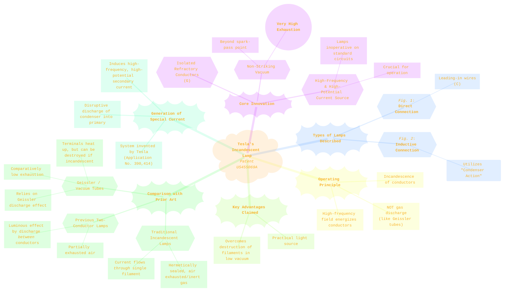
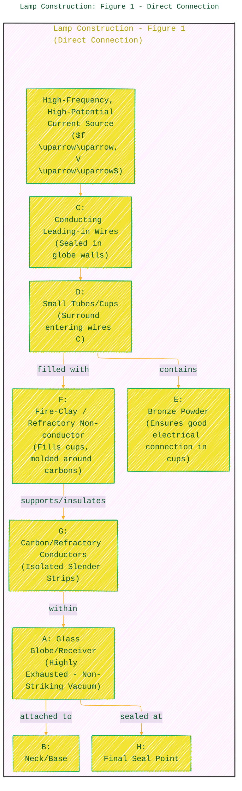
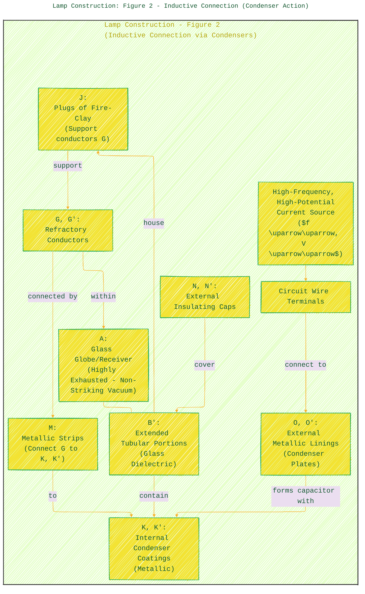
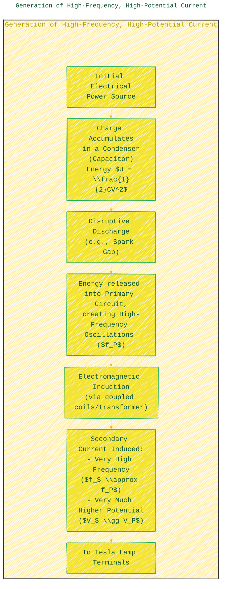

> ⚠️🏗️🚧🦺🧱🪵🪨🪚🛠️👷
> 
> This is a working draft in progress
> 
> 
>
> gif image is provided by [Giphy](https://giphy.com)
> 
> ⚠️🏗️🚧🦺🧱🪵🪨🪚🛠️👷

----

# U.S patent 455,069 - Electric Incandescent Lamp
> **Disclaimer:**
>
> This document contains my personal notes on the topic,
> compiled from publicly available documentation and various cited sources.
> The materials are intended for educational purposes, personal study, and reference.
> The content is dual-licensed:
> 1. **MIT License:** Applies to all code implementations (Swift, Mermaid, and other programming languages).
> 2. **Creative Commons Attribution-ShareAlike 4.0 International License (CC BY-SA 4.0):** Applies to all non-code content, including text, explanations, diagrams, and illustrations.
---

## Nikola Tesla's Electric Incandescent Lamp (U.S. Patent 455,069) 💡

**Inventor:** Nikola Tesla
**Patent Date:** June 30, 1891
**Source:** [Google Patents - US455069A](https://patents.google.com/patent/US455069A/en)

This invention describes a novel form of electric incandescent lamp where light is produced by the incandescence of carbon or other suitable refractory conductors. The key innovation lies in using **two isolated conductors** within a **very highly exhausted receiver (a "non-striking vacuum")** powered by currents of **very great frequency and very high potential**. This was markedly different from existing lamps.

---

## Core Concepts and Distinguishing Features 🌟

Tesla's lamp design aimed to overcome limitations of previous electric lamps and vacuum tubes. Here's an overview:

----

## Lamp Construction: Figure 1 - Direct Connection 🛠️

---

<!--  -->

<!--  -->

---

<figure>
    
    <figcaption>Figure 1: Direct Connection  and Figure 2: Inductive Connection</figcaption>
</figure>

This version of the lamp involves directly connecting the internal conductors to the external power source using leading-in wires.

**Manufacturing Notes for Fig. 1:**
1.  Assemble components as shown.
2.  Attach to vacuum pump.
3.  During exhaustion, bring carbons (G) to incandescence with a suitable current to bake fire-clay (F) and drive off occluded gases.
4.  Carry exhaustion to the "highest possible point" (non-striking vacuum).
5.  Seal off the globe at (H).
6.  *Precaution*: Insulate external conductors well to prevent current dissipation. Ends of carbons might be brought closer initially to allow sparks to leap between them, reducing injury risk before high vacuum is achieved.

---

## Lamp Construction: Figure 2 - Inductive Connection (Condenser Action) 🔌⚡

This version employs an inductive connection using condenser (capacitor) principles, avoiding direct wired connections to the internal conductors from outside the main globe.

**Operational Note for Fig. 2:**
Energy is transmitted from the external circuit (via O, O') to the internal conductors (G, G') through **condenser action**. The glass (B') acts as the dielectric between the internal (K, K') and external (O, O') coatings. Tesla notes: "no visible discharge or transfer of current from one to the other through the highly-rarefied medium between them." The incandescence is attributed to this condenser action with the specialized current.

----

## Principle of Operation & Key Requirements 🔑

The functionality of these lamps hinges on specific electrical conditions and physical construction.

```mermaid
---
title: "Principle of Operation & Key Requirements"
author: "Cong Le"
version: "1.0"
license(s): "MIT, CC BY-SA 4.0"
copyright: "Copyright (c) 2025 Cong Le. All Rights Reserved."
config:
  layout: elk
  theme: base
  look: classic
---
%%%%%%%% Mermaid version v11.4.1-b.14
%%%%%%%% Available curve styles include the following keywords:
%% basis, bumpX, bumpY, cardinal, catmullRom, linear, monotoneX, monotoneY, natural, step, stepAfter, stepBefore.
%%{
  init: {
    'flowchart': { 'htmlLabels': true, 'curve': 'basis' },
    'fontFamily': 'American Typewriter, monospace',
    'themeVariables': {
      'primaryColor': '#F3E333',
      'primaryTextColor': '#145A32',
      'lineColor': '#F8B229',
      'primaryBorderColor': '#27AE60',
      'secondaryColor': '#EBDEF0',
      'secondaryTextColor': '#6C3483',
      'secondaryBorderColor': '#A569BD',
      'fontSize': '20px'
    }
  }
}%%
flowchart TD
    subgraph Operating_Block["Operational Requirements & Principle"]
    style Operating_Block fill:#cce5ff,stroke:#333,stroke-width:2px

        Input["Electrical Energy Source"] --> Conditions

        subgraph Conditions["Critical Operating Conditions"]
        direction LR
            Freq["Very High Frequency Current<br/>($f_{source} \gg \text{standard AC Hz}$)"]
            Pot["Very High Potential<br/>(Voltage)<br/>($V_{source} \gg \text{standard line V}$)"]
            Vac["Non-Striking Vacuum<br/>(Exhaustion beyond spark point)"]
        end

        Conditions --> Mechanism

        subgraph Mechanism["Luminosity Mechanism"]
            RefConductor["Isolated Refractory Conductors<br/>(G)"]
            Incandescence["Conductors Glow Hot<br/>(Incandesce)"]
            CondAct_Label{"Fig. 2 Specific:"}
            CondAct["Energy Transfer via Condenser Action<br/>(Charges rapidly alternate on conductors G)"]

            RefConductor --> Incandescence
            CondAct_Label -.-> CondAct
            %% For Fig. 2, Condenser Action directly leads to Incandescence
            %% For Fig. 1, the high-frequency, high-potential current directly causes incandescence in G
        end
        
        Mechanism --> Output["Light Emission 💡"]
    end
```

The "condenser action" is essentially the displacement current and the rapidly alternating electric field between the conductors G within the highly evacuated globe, induced by the high-frequency, high-potential source. The energy associated with this field causes the material of the conductors G to heat up to incandescence.

---

## Comparison with Prior Art 🧐

Tesla explicitly distinguishes his invention from previous technologies.

| Feature                     | Tesla's Patented Lamp (US455069A)                                          | Prior Art 1: Standard Incandescent (e.g., Edison)             | Prior Art 2: Two-Conductor Discharge Lamp                   | Geissler / Vacuum Tubes                                           |
| :-------------------------- | :------------------------------------------------------------------------- | :------------------------------------------------------------ | :---------------------------------------------------------- | :---------------------------------------------------------------- |
| **Number of Conductors**    | Two, isolated from each other                                              | Typically one continuous filament                             | Two independent conductors                                  | Two or more terminals/electrodes                                  |
| **Vacuum Level**            | **Very High (Non-striking)**                                               | High (exhausted or inert gas)                                 | Partially exhausted                                         | Comparatively Low (sufficient for gas discharge)                  |
| **Current Type for Light**  | **Very High Frequency & Very High Potential**                              | Direct current (DC) or Low Frequency Alternating Current (AC) | Current discharge *between* conductors through rarefied gas | High-tension secondary discharge *through* the gas                |
| **Luminous Effect**         | **Incandescence** of refractory conductors G                               | Incandescence of the filament                                 | Gas discharge (arc/glow) between conductors                 | Gas discharge (glow, striations), terminal heating                |
| **Filament/Conductor Life** | Designed for practicality and stability with special current               | Susceptible to burnout                                        | Conductors can be consumed by discharge                     | Terminals/points could be speedily destroyed if made incandescent |
| **Primary Mechanism**       | Energizing isolated conductors in high vacuum (condenser action for Fig.2) | Resistive heating ($P = I^2R$)                                | Electrical breakdown of gas                                 | Ionization and excitation of rarefied gas                         |

---

## Generation of High-Frequency, High-Potential Current ⚡🌀

Tesla mentions his system for producing these specialized currents, detailed in a separate application (No. 390,414). The description points to a resonant transformer circuit, a precursor to the Tesla Coil.

This method is characteristic of Tesla's high-frequency work, allowing for the generation of the necessary electrical conditions to operate these novel lamps.

---

## Claims Summary 📜

The patent claims highlight the novelty:
1.  An incandescent lamp with **two isolated refractory conductors** in a **non-striking vacuum**, producing light by incandescence, each with a terminal.
2.  Combination: A globe exhausted to the **non-striking point**, two isolated refractory conductors for incandescence, and means to connect them to a power source.
3.  Combination for an incandescent lamp: Globe exhausted to non-striking point, sealed metallic wires, refractory body on each wire, with **insulation covering wires and non-incandescent parts** within the globe.
4.  Combination: Globe exhausted to non-striking point, sealed metallic wires, refractory conductor to each wire, insulating covering around wires/joint, and **refractory insulating body around conductors near the joint**.

---

In essence, Tesla's patent describes a sophisticated lamp system that relied on principles of high-frequency alternating currents and high vacuum technology, moving beyond the limitations of direct current incandescence and gas discharge lighting of the era. His work in this area was foundational for later developments in lighting and radio frequency technology. ✨

---
**Disclaimer:** Diagrams are schematic representations based on the textual description and figures in the patent. For exact engineering details, the original patent document is the definitive source.

---

<!-- 

---
>**Licenses:**
>
>- **MIT License:**   - Full text in [LICENSE](LICENSE) file.
>- **Creative Commons Attribution-ShareAlike 4.0 International**: [CC BY-SA 4.0](https://creativecommons.org/licenses/by-sa/4.0/)  - Legal details in [LICENSE-CC-BY-SA-4.0](THE_PAST/LICENSE-CC-BY-SA-4.0) and at [Creative Commons official site](https://creativecommons.org/licenses/by-sa/4.0/).
>
---