> ⚠️🏗️🚧🦺🧱🪵🪨🪚🛠️👷
> 
> This is a working draft in progress
> 
> 
>
> gif image is provided by [Giphy](https://giphy.com)
> 
> ⚠️🏗️🚧🦺🧱🪵🪨🪚🛠️👷

----

# U.S. Patent Number 514,170 - Incandescent Electric Light
> **Disclaimer:**
>
> This document contains my personal notes on the topic,
> compiled from publicly available documentation and various cited sources.
> The materials are intended for educational purposes, personal study, and reference.
> The content is dual-licensed:
> 1. **MIT License:** Applies to all code implementations (Swift, Mermaid, and other programming languages).
> 2. **Creative Commons Attribution-ShareAlike 4.0 International License (CC BY-SA 4.0):** Applies to all non-code content, including text, explanations, diagrams, and illustrations.
---

## Patent Overview 📜

*   **Inventor:** Nikola Tesla
*   **Patent Number:** 514,170
*   **Title:** Incandescent Electric Light
*   **Patented Date:** February 6, 1894
*   **Application Filed:** January 2, 1892 (Renewed December 15, 1893)
*   **Key Idea:** To prevent energy dissipation from the supporting conductors within the lamp by using an electrostatic screen, thereby concentrating the energy on the light-emitting element.

---

## The Problem Addressed 🤔

Tesla observed that when using currents of very high potential and great frequency (a hallmark of his experiments), a significant amount of energy would dissipate from the conductors. This happened even if the conductors were well-insulated, both inside and outside the lamp globe. This energy loss meant that the lamp wasn't as efficient as it could be, and the energy wasn't being directed solely to the part intended to produce light.

```mermaid
---
title: "The Problem Addressed"
author: "Cong Le"
version: "1.0"
license(s): "MIT, CC BY-SA 4.0"
copyright: "Copyright (c) 2025 Cong Le. All Rights Reserved."
config:
  layout: elk
  theme: base
  look: classic
---
%%%%%%%% Mermaid version v11.4.1-b.14
%%%%%%%% Available curve styles include the following keywords:
%% basis, bumpX, bumpY, cardinal, catmullRom, linear, monotoneX, monotoneY, natural, step, stepAfter, stepBefore.
%%{
  init: {
    'flowchart': { 'htmlLabels': true, 'curve': 'basis' },
    'fontFamily': 'American Typewriter, monospace',
    'themeVariables': {
      'primaryColor': '#F3E333',
      'primaryTextColor': '#F8B229',
      'lineColor': '#F8B229',
      'primaryBorderColor': '#27AE60',
      'secondaryColor': '#EF2',
      'secondaryTextColor': '#6C3483',
      'secondaryBorderColor': '#A569BD',
      'fontSize': '20px'
    }
  }
}%%
flowchart TD
    A["High Potential & High Frequency Currents⚡️"] --> B{"Energy Dissipation from Conductors"}
    B -- "Observed in practice" --> C("Loss from lead-in wires & supports")
    C --> D("Reduced efficiency & potential overheating of non-light parts")
    D --> E("Goal:<br/>Maximize light output for given energy input")

    style A fill:#f9f2,stroke:#333,stroke-width:2px
    style B fill:#ff92,stroke:#333,stroke-width:2px
    style C fill:#ffc2,stroke:#333,stroke-width:2px
    style D fill:#fcc2,stroke:#333,stroke-width:2px
    style E fill:#9f92,stroke:#333,stroke-width:2px
```

---

## Tesla's Ingenious Solution: The Static Screen ✨

To combat this energy dissipation, Tesla proposed a clever solution: surrounding the leading-in and supporting conductors (within the lamp globe) with another conductor that acts as a **static screen**.

This screen, typically a thin metallic tube (Tesla preferred aluminum), is insulated from the internal conductors and any external bodies. Its purpose is to confine the electrical action primarily to the light-giving "button" or filament. By doing so, the button could be brought to a higher degree of incandescence more quickly and efficiently.

**Core Principle:** The electrostatic screen reduces the loss of energy supplied to the bulb by preventing its radiation or dissipation into the surrounding space, except through the exposed light-giving button.

Let's visualize the described lamp structure:

Click to show/hide the full native PlantUML implementation with comment documentation.

This diagram corresponds to the drawing in the patent document:
*   **A:** Glass globe
*   **B:** Thin conducting wire (leading in)
*   **C:** Stem of glass or other refractory insulator
*   **D:** Mass of carbon paste (uniting B to E)
*   **E:** Carbon or other refractory stem (supporting F)
*   **F:** Small button of carbon or other suitable substance (the light element)
*   **G:** Metallic tube (static screen, e.g., aluminum)
*   **K:** Point where the globe is sealed off after evacuation

----

## The Science Behind the Screen: Electrostatic Action 🔬

The patent emphasizes the "electrostatic action" of the screen. While not detailed with equations in the patent, the principle relates to how conductors behave in electric fields.

1.  **High-Frequency Fields:** The high-potential, high-frequency currents on conductor `B` and stem `E` would generate rapidly changing electric fields around them.
2.  **Energy Dissipation:** Without the screen, these fields could extend outwards to the glass globe `A` or even further, leading to energy loss through capacitive coupling or dielectric losses in the surrounding materials, or direct radiation.
3.  **The Screen's Role (G):** The metallic tube `G` acts as an electrostatic shield.
	*   It effectively confines the majority of the electric field generated by the inner conductor `B` and stem `E` to the space *between* `B/E` and `G`.
	*   This prevents the field from significantly interacting with the globe `A` or radiating outwards from the stem assembly.
	*   The energy is thus channeled more directly to the exposed button `F`.

This is somewhat analogous to a **Faraday cage** principle but applied internally to manage energy flow within the lamp. The goal is to ensure that the energy delivered is used to heat the filament `F` to incandescence rather than being lost from the support structure.
The effective "electrical action" is thus concentrated on the button `F`.

Achieving a higher temperature ($T$) at the button `F` means more intense light. The total power radiated by an incandescent body is described by the **Stefan-Boltzmann Law**:

$$
P = \epsilon \sigma A T^4
$$

Where:
*   $P$ = Total radiated power
*   $\epsilon$ = Emissivity of the material
*   $\sigma$ = Stefan-Boltzmann constant ($5.67 \times 10^{-8} \, W m^{-2} K^{-4}$)
*   $A$ = Surface area
*   $T$ = Absolute temperature in Kelvin

And the peak wavelength of the emitted light (determining its color) is given by **Wien's Displacement Law**:

$$
\lambda_{peak} = \frac{b}{T}
$$

Where:
*   $b$ = Wien's displacement constant ($2.898 \times 10^{-3} \, m \cdot K$)

By confining energy to `F`, Tesla aimed to increase $T$, thereby increasing $P$ (brightness) for a given input, and shifting $\lambda_{peak}$ towards a more desirable (e.g., whiter) light.

---

## Patent Claims Breakdown 🧐

The claims define the legal scope of the invention. Here's a summary:

```mermaid
---
title: "Patent Claims Breakdown"
author: "Cong Le"
version: "1.0"
license(s): "MIT, CC BY-SA 4.0"
copyright: "Copyright (c) 2025 Cong Le. All Rights Reserved."
config:
  theme: base
---
%%%%%%%% Mermaid version v11.4.1-b.14
%%{
  init: {
    'fontFamily': 'American Typewriter, monospace',
    'logLevel': 'fatal',
    'mindmap': {
	    'nodeAlign': 'center',
	    'padding': 20
    },
    'themeVariables': {
      'primaryColor': '#FC82',
      'primaryTextColor': '#F8B229',
      'primaryBorderColor': '#27AE60',
      'secondaryColor': '#EBF3',
      'secondaryTextColor': '#6C3483',
      'secondaryBorderColor': '#A569BD',
      'fontSize': '20px'
    }
  }
}%%
mindmap
  root)"**Key Aspects of Claims in US Patent 514,170**"(
    Claim1))"**Claim1**"((
      Description("Description:<br/>Combination of an exhausted globe, a refractory light-giving body, a conductor leading into the globe and connected to/supporting the body, AND a conducting screen surrounding said conductor")
      Key_Elements("*Key Elements*")
	      Exhausted_Globe["Exhausted Globe 💨"]
	      Light_giving_Body["Light-giving Body 🔥"]
	      Conductor["Conductor<br/>(lead-in & support) 🧵"]
	      Conducting_Screen["Conducting Screen<br/> (shielding) 🛡️"]
    Claim2))"**Claim2**"((
      Description("Description:<br/>Similar to Claim 1, but specifies the light-giving body as a **button** and the screen as a **metallic tube** surrounding the conductor up to its union with the button")
      Key_Elements("*Key Elements*")
	      Exhausted_Globe["Exhausted Globe 💨"]
	      Light_giving_Button_Body["Light-giving Button/Body 🔥"]
	      Conducting_Support["Conducting Support<br/>(for button) 🧵"]
	      Metallic_Tube["Metallic Tube<br/>(shielding up to button) 🛡️"]
    Claim3))"**Claim3**"((
      Description("Description:<br/>More specific construction details. An exhausted globe, a wire sealed in (coated/embedded in a glass stem), a carbon stem united with the wire, a refractory conductor (light element) on the carbon stem, AND a conducting tube/cylinder surrounding the wire and carbon stem for the stated purpose<br/>(shielding)")
      Key_Elements("*Key Elements*")
	      Exhausted_Globe["Exhausted Globe 💨"]
	      Sealed_Wire["Sealed Wire<br/>(in glass stem)<br/>🔌"]
	      Carbon_Stem["Carbon Stem 🌲"]
	      Refractory_Conductor["Refractory Conductor<br/> (light element)<br/>🔥"]
	      Conducting_Tube_Cylinder["Conducting Tube/Cylinder<br/>(shielding wire & carbon stem)<br/>🛡️"]
```

---

## Significance and Conclusion 🎉

Tesla's invention addressed a practical problem in the early days of high-frequency electrical systems. By introducing the concept of an internal electrostatic screen, he provided a method to improve the efficiency of incandescent lamps designed for such currents. This focuses energy where it's needed – the light-emitting element – thus achieving brighter and more efficient illumination. This patent is another example of Tesla's deep understanding of electrical phenomena and his innovative approach to solving engineering challenges.

---

<ins>📢 **Disclaimer** 🚨</ins>
> Diagrams are schematic representations based on the textual description and figures in the patent. For exact engineering details, the original patent document is the definitive source.

---

<!-- 

---
>**Licenses:**
>
>- **MIT License:**   - Full text in [LICENSE](LICENSE) file.
>- **Creative Commons Attribution-ShareAlike 4.0 International**: [CC BY-SA 4.0](https://creativecommons.org/licenses/by-sa/4.0/)  - Legal details in [LICENSE-CC-BY-SA-4.0](THE_PAST/LICENSE-CC-BY-SA-4.0) and at [Creative Commons official site](https://creativecommons.org/licenses/by-sa/4.0/).
>
---

### Reference
N. Tesla, "Incandescent Electric Light," U.S. Patent 514,170, Feb. 6, 1894. Google Patents: [https://patents.google.com/patent/US514170A/en](https://patents.google.com/patent/US514170A/en)

----

